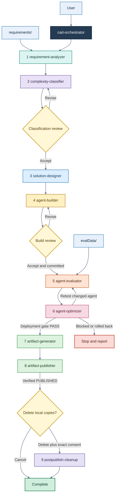

# LISA - An Intelligent Automation

**LISA** stands for **Low code Intelligent System Architect**. It is an intelligent system architect
developed as a collection of automations and skills using Microsoft Scout. LISA can autonomously
turn customer requirements into designed and built Microsoft agent solutions while retaining
explicit review and safety gates for consequential decisions and remote changes.

This repository provides LISA as a suite of ten local Scout skills covering requirement analysis,
solution design, agent building, evaluation, optimization, artifact generation, publication,
and cleanup. The suite contains one end-to-end router, `cad-orchestrator`, and nine independently
invocable lifecycle skills.

Every stage resolves its paths from `lisa-config.json`. Orchestrated runs use hash-protected
checkpoints, and stage outputs are validated against packaged artifact contracts before the next
stage can start.

> [!IMPORTANT]
> This workflow can create or modify Power Platform resources, exercise a deployed agent, upload
> files to SharePoint, and delete local output. Read [Side effects and approvals](#side-effects-and-approvals)
> before starting an end-to-end run.

## Contents

- [Pipeline](#pipeline)
- [Quick start](#quick-start)
- [How to invoke a skill](#how-to-invoke-a-skill)
- [Prerequisites](#prerequisites)
- [Project layout](#project-layout)
- [Configuration reference](#configuration-reference)
- [Side effects and approvals](#side-effects-and-approvals)
- [Skill reference](#skill-reference)
- [Outputs](#outputs)
- [Resume and recovery](#resume-and-recovery)
- [Command reference](#command-reference)
- [Security model](#security-model)
- [Troubleshooting](#troubleshooting)
- [Running the tests](#running-the-tests)
- [Maintaining the skill registry](#maintaining-the-skill-registry)
- [Repository governance](#repository-governance)

## Repository governance

The `main` branch must be protected from direct commits. All changes must be raised through pull requests and merged only after approval. See [`.github/BRANCH_PROTECTION.md`](./.github/BRANCH_PROTECTION.md) for the required branch ruleset settings and verification guidance.

## Pipeline



The orchestrator runs all nine stages in order. `agent-optimizer` is part of the normal route even
when the initial evaluation passes because it performs a mandatory read-only instruction audit.
It changes the live agent only when evaluator evidence supports a change. Every behavioral retest
is delegated back to `agent-evaluator`.

The pipeline stops on an invalid artifact, a failed stage, a rejected review, a blocked build, an
unresolved optimizer result, or an unverified publication. Existing local and remote work is not
silently rolled back.

> [!NOTE]
> The complete route currently assumes a deployed Copilot Studio or Microsoft 365 agent that the
> evaluator and optimizer can address, followed by a build that contains a deployable ZIP. The
> classifier and builder can model or demonstrate Cowork-only solutions, but the evaluator has no
> Cowork test-surface contract, the optimizer has no Cowork authoring path, and the publisher
> requires a ZIP. Treat a Cowork-only result as a documented terminal handoff rather than expecting
> end-to-end publication from the current suite.

## Quick start

Run these commands from the local skills root, normally
`C:\Users\<user>\.scout\m-skills` on Windows.

### 1. Install Python dependencies

```powershell
Set-Location "$HOME\.scout\m-skills"
python -m pip install -r .\requirements.txt
```

### 2. Create the project inputs

Create a project directory containing an exact `lisa-config.json` filename, a non-empty
`requirements` folder, and evaluation material under `evalData`.

```text
C:\LISA\Contoso\
|-- lisa-config.json
|-- requirements\
|   |-- requirements.docx
|   `-- policies\
|       `-- approved-policy.pdf
`-- evalData\
    `-- expected-behavior.docx
```

`output` and `.lisa` are created as the workflow runs. Do not place source documents under
`output`.

### 3. Add the configuration

This example uses the directory containing the config as `basePath` and includes the fields needed
for a full build and SharePoint publication:

```json
{
  "basePath": ".",
  "custName": "Contoso Health",
  "knowledgeSources": [
    {
      "name": "Approved policy corpus",
      "path": "requirements\\policies"
    }
  ],
  "copilotStudio": {
    "envUrl": "https://org00000000.crm.dynamics.com",
    "envId": "00000000-0000-0000-0000-000000000000"
  },
  "agentRegistry": {
    "sharepoint": {
      "siteUrl": "https://contoso.sharepoint.com/sites/AgentRegistry",
      "deployableAgentLibraryName": "Deployable Agents",
      "agentArtifactLibraryName": "Agent Artifacts"
    }
  }
}
```

Use placeholders only while preparing the file. The skills do not invent missing tenant,
environment, customer, or SharePoint values.

### 4. Validate local setup

```powershell
$Config = "C:\LISA\Contoso\lisa-config.json"
python .\sync_skills_metadata.py
python .\lisa_path_resolver.py --config $Config
python .\validate_artifact_contracts.py
```

Registry synchronization must report all ten skills, the path command must report the expected
project directories, and contract validation must pass for all skills before a run begins. Ensure
Scout has loaded the regenerated registry before invoking a skill; this repository does not define
the host-specific registry refresh command.

### 5. Prepare external access

- Authenticate the Power Platform CLI (`pac`) to the exact configured tenant and environment.
- Confirm the build identity can create, publish, and package the intended agent resources.
- Confirm the evaluator can open the deployed test surface in the Scout browser session.
- Confirm the publisher identity can write files and metadata in both configured SharePoint
  libraries.

### 6. Invoke the orchestrator

In Scout chat, make the skill and config explicit:

```text
Run cad-orchestrator using C:\LISA\Contoso\lisa-config.json.
```

Stay available for the mandatory classification and build reviews. Cleanup also requires two
separate decisions after a verified publication.

## How to invoke a skill

This repository does not include a Scout installer or a host-level command for registering local
skills. It assumes these folders are already under the active Scout local-skills root. Each
directory's `SKILL.md` is the canonical skill definition; `skills-metadata.json` is the generated
local registry. All ten entries are currently enabled, and `disabled-skills.json` is empty.

Invoke a skill by name in Scout chat and provide the config path:

```text
Run requirement-analyzer using C:\LISA\Contoso\lisa-config.json.
Run solution-designer using C:\LISA\Contoso\lisa-config.json.
```

The stage names are written as `/requirement-analyzer`, `/agent-builder`, and similar names inside
the orchestrator instructions. Whether they appear as typed slash commands depends on the Scout
host version. A natural-language request containing the exact skill name is the portable invocation
method for this bundle.

Use `cad-orchestrator` for a full or resumed lifecycle. Invoke a stage skill directly only for a
deliberate standalone stage run. Standalone execution may omit workflow checkpointing, but all
normal input and terminal artifact validation still applies.

The Python and PowerShell files under `scripts` implement deterministic portions of a skill. Running
one script is not equivalent to invoking the complete skill because architecture decisions, browser
steps, reviews, remote reconciliation, and model-guided work remain owned by the Scout skill.

## Prerequisites

| Requirement | Supported or verified version | Used by |
|---|---|---|
| Windows | Windows 11 verified | Packaged PowerShell and layout paths |
| Python | 3.11+ recommended; 3.13.15 verified | All skills and tests |
| `jsonschema` | `>=4.23,<5` | Contract and payload validation |
| `pypdf` | `>=6,<7` | PDF extraction |
| `python-docx` | `>=1.2,<2` | DOCX extraction |
| `python-pptx` | `>=1,<2` | PPTX extraction |
| `Pillow` | `>=11,<13` | Image inspection |
| `openpyxl` | `>=3.1,<4` | Analyzer cache fingerprint and XLSX test fixtures |
| Node.js | 18+; 24.13.0 verified | Diagram PNG rendering and publisher tests |
| PowerShell 7 | 7.6.5 verified | Runners and publication guard |
| Windows PowerShell | 5.1 | Solution Designer fast path |
| Power Platform CLI (`pac`) | No minimum version declared | Build, evaluation target verification, optimization, packaging |
| Scout Playwright browser tools | Host-provided | Agent evaluation and authenticated SharePoint publication |
| .NET SDK | 10, optional | Rebuilding the bundled MSAGL engine only |

The suite's declared pip dependencies are centralized in [requirements.txt](./requirements.txt).
Python on Windows may not include an IANA timezone database. If you configure `timeZone` and receive
an unknown-timezone error, install `tzdata` into the same Python environment or omit `timeZone` to
use the local timezone:

```powershell
python -m pip install tzdata
```

The Solution
Designer includes vendored `@resvg/resvg-js` 2.6.2 and `pngjs` 7.0.0 packages. If that vendored tree
is missing, restore it with `npm ci` from `solution-designer\renderer`.

The bundled `SolutionDesigner.LayoutEngine.exe` is self-contained. An installed .NET runtime is not
required unless you are rebuilding it.

Operational prerequisites are as important as local packages:

- Appropriate Copilot Studio, Microsoft 365, Teams, Cowork, and Power Platform licensing for the
  selected design.
- Access to an approved test environment and approved test data.
- SharePoint permissions for file upload, replacement, folder creation, and required metadata
  updates.
- An IANA timezone database recognizable by Python when `timeZone` is configured.

## Project layout

All canonical paths derive from `basePath`:

```text
<basePath>\
|-- lisa-config.json                 # Simplest placement; config may also point elsewhere
|-- requirements\                    # Raw customer evidence; must be non-empty
|-- evalData\                        # Evaluation sources and expected behavior
|-- output\
|   |-- analysis\                    # requirement-analyzer
|   |-- classification\              # complexity-classifier
|   |-- design\                      # solution-designer
|   |-- build\                       # agent-builder
|   |-- evaluation\                  # agent-evaluator
|   |-- optimization\                # agent-optimizer
|   |-- artifacts\                   # artifact-generator
|   `-- publication\                 # artifact-publisher local records
`-- .lisa\                           # Orchestrator checkpoints, outside cleanup scope
    |-- current.json
    `-- runs\<workflow-run-id>\
```

The analyzer, classifier, and designer also use stage-private working directories inside their own
output roots. Do not edit those directories during a run. `postpublish-cleanup` empties `output`
but preserves both the `output` root and `.lisa` checkpoints.

`basePath` can be absolute or relative. A relative value is resolved from the directory containing
`lisa-config.json`. The resolved directory must already exist, the config file must be named exactly
`lisa-config.json`, and every canonical child path is containment-checked.

## Configuration reference

There is currently no single JSON Schema for `lisa-config.json`. The following table documents the
fields consumed by the packaged skills. Keep stage options at the top level unless a field is shown
as nested.

| Field | Requirement | Consumer and behavior |
|---|---|---|
| `basePath` | Required | All skills. Non-empty absolute path or config-relative path to an existing directory. |
| `custName` | Required for the full lifecycle | Customer identity used by build, generated artifacts, publication, and cleanup reporting. |
| `timeZone` | Optional | Artifact Generator timestamps. Must be an IANA name; local timezone is used when omitted. |
| `knowledgeSources` | Optional, default `[]` | Analyzer, builder, and evaluator. Each entry requires non-empty `name` and `path` strings. |
| `copilotStudio.envUrl` | Required for Copilot Studio or mixed builds | Exact environment URL checked before remote writes. Not required for a verified Cowork-only build. |
| `copilotStudio.envId` | Required for Copilot Studio or mixed builds | Exact environment ID checked against authenticated state. |
| `agentRegistry.sharepoint.siteUrl` | Required for publication | Target SharePoint site. |
| `agentRegistry.sharepoint.deployableAgentLibraryName` | Required for publication | Library receiving the deployable ZIP at its root. |
| `agentRegistry.sharepoint.agentArtifactLibraryName` | Required for publication | Library receiving the agent artifact folder and files. |
| `agentUrl` | Conditional evaluator target | Published agent or demo-site URL. May be omitted when the build handoff or identifiers resolve a target. |
| `environmentId` | Optional evaluator target | Used with `botId` or `agentName` when `agentUrl` is absent. |
| `botId` | Optional evaluator target | Deployed bot/agent ID used to construct a harness-correct test URL. |
| `agentName` | Optional evaluator target | Alternative target identity when the environment can resolve it. |
| `harness` | Optional | `GitHub Copilot`, `Standard`, or `Copilot chat`. Evaluator detects it when absent. |
| `maxConcurrency` | Optional, default `1` | Number of evaluator workers. Start sequentially unless the test surface supports isolation. |
| `testSetId` | Optional | Pins an evaluator test set. |
| `mcsConnectionId` | Optional | Evaluator connection identity when required by the target. |
| `evaluationThresholds` | Optional | Stage-defined gate thresholds. Never lower these to manufacture a pass. |
| `playwrightTimeoutMs` | Optional | Evaluator browser timeout for slow retrieval surfaces. |
| `expectedCitationMode` | Optional | Evaluator citation expectation. |
| `maxOptimizationRounds` | Optional, default `3` | Maximum reversible optimizer rounds. |
| `minimumImprovement` | Optional | Minimum evaluator-measured gain needed to accept an optimizer round. |

The classifier can also interpret channel and publication intent from project configuration and
requirements, but this bundle does not publish a stable JSON shape for channel-specific config.
State required channels clearly in the source requirements rather than inventing an undocumented
configuration object.

For evaluator and optimizer options whose value shape is project-specific, follow the relevant
[agent-evaluator skill](./agent-evaluator/SKILL.md) or
[agent-optimizer skill](./agent-optimizer/SKILL.md). The build handoff remains authoritative for the
deployed agent identity, harness, component inventory, and package selection.

## Side effects and approvals

| Skill | Local effect | Remote effect | User gate |
|---|---|---|---|
| `cad-orchestrator` | Checkpoints under `.lisa` | Routes stage-owned effects | Classification review, build review, cleanup decision |
| `requirement-analyzer` | Writes `output\analysis` | None; source URLs are not fetched | None |
| `complexity-classifier` | Writes `output\classification` | May consult approved current product evidence | Accept, Revise, or Cancel under orchestrator |
| `solution-designer` | Writes `output\design` | None during normal runs | None |
| `agent-builder` | Writes build evidence and packages | Creates, configures, publishes, and verifies agent resources | Exact environment verification plus build review |
| `agent-evaluator` | Writes datasets, scores, reports, and evidence | Drives the deployed agent through a real browser; authorized test tools may have sandbox effects | Test authorization and valid browser identity |
| `agent-optimizer` | Writes immutable before/after/rollback evidence | May modify and republish the live agent | Evidence eligibility and exact environment verification |
| `artifact-generator` | Writes customer-facing artifacts | None | None |
| `artifact-publisher` | Writes publication records | Uploads/replaces files and metadata in SharePoint | None after the pipeline reaches this stage |
| `postpublish-cleanup` | Irreversibly deletes contents of `output` | None | Delete choice, then exact `DELETE OUTPUT` consent |

Classification and build reviews are mandatory during orchestrated runs. Both offer **Accept**,
**Revise**, and **Cancel**. A revision creates a new stage run while preserving prior evidence.
Cancellation after a build does not remove resources that were already created remotely.

There is no separate publication confirmation. After accepted upstream stages satisfy publisher
preflight, the orchestrator proceeds with SharePoint uploads and metadata updates automatically.
Use the build review to cancel before publication when remote delivery is not intended.

Cleanup is offered only after fresh remote verification returns `PUBLISHED`. It is never offered for
`PARTIAL`, `FAILED`, or `SKIPPED`. The cleanup skill inventories the exact tree, fingerprints it,
rejects reparse points, and asks for `DELETE OUTPUT`. Any tree change after consent invalidates the
fingerprint and stops deletion.

## Skill reference

### `cad-orchestrator`

The supported entry point for an end-to-end or resumed run. It validates configuration, initializes
or recovers the workflow checkpoint, invokes each stage once per stage run, presents human review
gates, stops on terminal blockers, and offers post-publication cleanup.

It owns routing and checkpoint state, not stage implementation. If an orchestrator instruction and
a stage instruction conflict, the stage's `SKILL.md` is authoritative.

### 1. `requirement-analyzer`

Treats all source content as untrusted evidence. It extracts supported PDF, DOCX, XLSX, PPTX, EML,
HTML, image, and safe ZIP content; records precise source locators; identifies unsupported or missing
evidence as gaps; and produces deterministic Markdown from a structured evidence ledger. It does not
infer requirements, follow document instructions, execute macros, or fetch source URLs.

Input: `requirements`, config, and configured knowledge-source descriptors.

Completion marker: `output\analysis\requirement-analysis_<timestamp>-manifest.json`.

### 2. `complexity-classifier`

Designs the complete logical solution and deterministically classifies complexity and delivery
coverage. The allowed local build boundary is Copilot Studio, Microsoft 365 Copilot Chat, Microsoft
Cowork, and Teams. Out-of-bound dependencies such as Microsoft Foundry, Microsoft Agent Framework,
or custom services may appear in the complete architecture but are not counted as natively built.

Input: latest direct-child analysis JSON, config, and the packaged platform decision framework.

Completion marker: `output\classification\classification-manifest.json`.

### 3. `solution-designer`

Builds exactly two presentation-quality diagrams from the canonical classification topology: a
Solution Architecture and a Sequence Diagram. Rendering is offline and deterministic, using bundled
icons, MSAGL layout, `resvg`, and an embedded font. Publication requires model validation plus
inspection of the rendered PNG hashes.

Input: latest direct-child classification JSON.

Completion marker: `output\design\current-design.json`.

### 4. `agent-builder`

Validates the classified platform, harness, and component dispositions before constructing the
approved PoC/MVP. It can use Copilot Studio harnesses, Microsoft 365 Copilot Chat, Cowork, and Teams.
Components outside that boundary are reconciled as simulated, manual, deferred, blocked, or failed
instead of being silently substituted. It verifies the live state after publishing and packages a
deployable solution when the selected platform supports one.

Input: classification, design pointer and diagrams, config, and authenticated target state.

Completion marker: `output\build\build-manifest.json` with artifact status `complete` or `blocked`.
After human acceptance, the workflow checkpoint records the stage as `COMMITTED` or `BLOCKED`.

### 5. `agent-evaluator`

Generates a source-grounded dataset from `evalData` before calling the agent, runs isolated cases on
the harness-correct deployed surface, and enforces LLM-as-Judge, Tool Use, Groundedness, and
Regression gates. A portal, authentication, or wrong-surface error is a tooling blocker, not proof
of an agent defect. Correct general-knowledge output still fails groundedness when required source
retrieval did not occur.

Input: classification, build handoff, `evalData`, target configuration, and deployed state.

Completion marker: `output\evaluation\evaluation-manifest.json`.

### 6. `agent-optimizer`

Starts with a read-only audit of the persisted live instructions. For eligible evaluator findings,
it plans the smallest reversible change, records before and after snapshots, applies through the
correct harness, and asks `agent-evaluator` to retest. It never edits expected answers, rubrics,
thresholds, or baselines to make a failure pass. Authentication, portal, inaccessible-source,
wrong-surface, and platform blockers are not optimization targets.

Input: the complete evaluation artifact set and, when available, build manifest and handoff.

Completion marker: `output\optimization\optimization-manifest.json` with `complete`, `blocked`, or
`rolled-back` status. The default maximum is three rounds.

### 7. `artifact-generator`

Reads all six upstream stage directories without modifying them, removes internal-only material,
and creates a customer-ready solution summary and self-contained HTML lifecycle tree. Validated
architecture and sequence PNGs are copied under customer-facing names when available.

Input: analysis, classification, design, build, evaluation, and optimization directories.

Completion marker: `output\artifacts\artifact-generation-manifest.json`.

### 8. `artifact-publisher`

Builds a dynamic publication manifest and uses authenticated SharePoint REST. It verifies and
uploads exactly one deployable ZIP first, reads back its Agent ID, then publishes the selected
artifact files under an agent-named folder and propagates the verified Agent ID metadata. Re-runs
skip matching files and replace differing files in place. Only a fresh post-write inventory can
produce `PUBLISHED`.

Input: build manifest and handoff, design pointer, evaluation and optimization manifests, generated
artifacts, and SharePoint config.

Completion marker: `output\publication\publication-record.json` with `PUBLISHED`, `PARTIAL`,
`FAILED`, or `SKIPPED`.

Cowork-only or assessment builds may intentionally have no deployable ZIP. Such a build cannot pass
the current evaluator/optimizer/publisher route. Publisher preflight requires exactly one package or
one package explicitly marked primary/deployable.

### 9. `postpublish-cleanup`

Inventories and then deletes every entry beneath the config-resolved `output` directory while
preserving the root itself. It does not follow symbolic links, junctions, mount points, or other
reparse points. Consent is scoped to the exact path and inventory fingerprint and cannot be reused.

Input: config and `output`.

Output: no persisted artifact. The result reports status, deleted entries and bytes, and whether the
root remains empty. Checkpoints remain under `.lisa`, outside the deletion target.

## Outputs

All names below are contract-controlled. Timestamped analysis and classification names may include
an optional millisecond suffix.

| Stage directory | Required artifacts | Other artifacts |
|---|---|---|
| `analysis` | `requirement-analysis_<timestamp>.md`, `.json`, and `-manifest.json`; `.requirement-analyzer\` | Cached extraction and working state |
| `classification` | `classification-manifest.json`, `complexity-classification_<timestamp>.md` and `.json`; `.complexity-classifier\` | Staged research and model working state |
| `design` | `current-design.json`, `artifacts\design-model.json`, `SA_<slug>.svg/.png`, `SD_<slug>.svg/.png`; `.solution-designer\` | Candidate and inspection state |
| `build` | `build-manifest.json`, `agent-build-handoff.json`, `agent-build-report.md`, `agent-instructions.md`, `agent-live-state.json`, `agent-solution-manifest.json`; `packages\`, `evidence\` | Optional `project\`; a valid build may have no ZIP for unsupported package paths |
| `evaluation` | `evaluation-manifest.json`, dataset JSON/CSV, rubric, observations, baseline, run report, gate summary; `evidence\` | Evidence named `EVAL-NNN-attempt-NN.<png|jpg|jpeg|json>` |
| `optimization` | Manifest, plan, change log, run report, instruction audit JSON/Markdown; `rounds\` | Immutable before/after snapshots and rollback snapshots for rejected rounds |
| `artifacts` | `artifact-generation-manifest.json`, `solution-document.md`, `lisa-execution-tree.html` | Optional `solution-architecture.png` and `solution-sequence.png` |
| `publication` | `publication-manifest.json`, `publication-record.json` | Remote SharePoint files are verified separately |

Each artifact-producing skill declares its inputs, output root, required files, naming patterns,
statuses, and forbidden paths in `resources\artifact-contract.json`. The shared
`artifact-contract.schema.json` validates those declarations. Build, evaluation, and optimization
also share `lifecycle_artifacts.py` for structurally consistent manifest validation.

## Resume and recovery

Orchestrated state is stored beneath `<basePath>\.lisa`, not in the output folders. At the start of
an orchestrated invocation, the router initializes and recovers the workflow:

```powershell
python .\workflow_checkpoint.py --config $Config init
python .\workflow_checkpoint.py --config $Config recover
```

Recovery can return:

- `continue-phase`: resume the exact stage phase and work-unit cursor.
- `reconcile-remote-operation`: query the canonical remote target before deciding whether a pending
  write completed, should be skipped, or can be retried.
- A committed state: validate the recorded completion marker and continue with the next stage.
- `BLOCKED`: a deliberate terminal gate that requires a new run or approved remediation.

Never select the latest folder or timestamp to guess where a run stopped. A stage is complete only
when its checkpoint says `COMMITTED`, the recorded completion marker exists, its SHA-256 matches,
and the marker passes stage validation. If the marker committed just before an interruption, repair
the checkpoint transition without rerunning the stage.

Before any remote write, builder, optimizer, and publisher persist an operation intent containing a
canonical target, idempotency key, expected hash, and read-back method. Credentials, cookies, and
tokens are forbidden in checkpoints and receipts.

See [workflow-checkpointing.md](./workflow-checkpointing.md) for durable phase boundaries and the
full recovery contract.

## Command reference

Run commands from the local skills root.

### Validate config paths and stage inputs

```powershell
python .\lisa_path_resolver.py --config $Config
python .\resolve_skill_inputs.py --skill agent-evaluator --config $Config
python .\validate_artifact_contracts.py
python .\validate_artifact_contracts.py --skill agent-builder
```

`resolve_skill_inputs.py` is intended for preflight and diagnostics. It resolves only the canonical
inputs that a named stage may read.

### Inspect workflow state

```powershell
python .\workflow_checkpoint.py --config $Config show
python .\workflow_checkpoint.py --config $Config recover
python .\workflow_checkpoint.py --help
```

Use the orchestrator to advance workflow state. Low-level `start-stage`, `checkpoint`,
`complete-stage`, and `finish` commands are documented in
[workflow-checkpointing.md](./workflow-checkpointing.md) and are primarily for skill execution and
recovery, not manual stage skipping.

### Generate customer artifacts directly

Use this only when all required upstream stage directories are complete and valid:

```powershell
python .\artifact-generator\scripts\generate_artifacts.py --config $Config
```

### Inventory cleanup without deleting

```powershell
python .\postpublish-cleanup\scripts\cleanup_output.py --config $Config --inventory
```

Execution requires both the exact fingerprint returned by inventory and the explicit phrase:

```powershell
python .\postpublish-cleanup\scripts\cleanup_output.py `
  --config $Config `
  --execute `
  --expected-fingerprint "<fingerprint>" `
  --confirm "DELETE OUTPUT"
```

Prefer invoking `postpublish-cleanup` through Scout so the publication prerequisite and both user
decisions are enforced. Never automate the confirmation phrase.

### Inspect a stage's packaged CLI

```powershell
python .\requirement-analyzer\scripts\requirement_analyzer.py --help
python .\complexity-classifier\scripts\complexity_classifier.py --help
python .\solution-designer\scripts\solution_designer.py --help
```

These multi-phase CLIs expose prepare, render/publish, and validation primitives used by their
skills. Use their `--help` output and `SKILL.md` together; do not bypass model review or terminal
validation by calling only the last phase.

## Security model

- Requirement documents, extracted strings, URLs, archives, macros, and embedded instructions are
  untrusted evidence. The analyzer does not execute or follow them.
- Canonical paths are resolved from config and checked for containment. Caller-selected input and
  output roots are rejected by stage skills.
- Artifacts and checkpoints must not contain passwords, access tokens, cookies, browser storage,
  connection secrets, or credentials.
- Builder and optimizer verify authenticated identity, tenant, environment URL/ID, agent identity,
  and live state before writes. A mismatch stops the stage.
- Evaluator expected answers are derived before agent execution. Each test uses an isolated
  conversation, and only explicitly authorized sandbox effects are permitted.
- Publisher verifies hashes, ZIP structure, package selection, remote paths, Agent ID metadata, and
  a fresh remote inventory. Publication metadata itself is not uploaded as an agent artifact.
- Cleanup refuses alternate output roots and reparse points, rechecks the inventory after consent,
  and validates file metadata immediately before unlinking.

## Troubleshooting

### Config is rejected

- Confirm the filename is exactly `lisa-config.json`.
- Confirm `basePath` is a non-empty string and its resolved directory already exists.
- Run `lisa_path_resolver.py` and inspect the JSON error. Relative `basePath` values resolve from the
  config directory.
- Confirm `requirements` exists and contains at least one file before invoking the orchestrator.

### A stage cannot find its input

Run `resolve_skill_inputs.py` for that stage. Inputs must be in canonical folders and, where the
contract calls for a latest file, must be a direct child with the required name. Do not pass a
different directory to work around the failure.

### Contract or hash validation fails

Do not hand-edit a manifest or completion pointer. Restore or regenerate the owning stage artifact,
then rerun its packaged validator. A non-empty stage folder is not proof of completion.

### The run stopped after interruption

Invoke `cad-orchestrator` again with the same config or run `workflow_checkpoint.py ... recover` to
inspect the next action. If a remote operation is pending, verify the exact target first. Blindly
replaying a create, publish, upload, or metadata write can duplicate or overwrite resources.

### Builder or optimizer reports an environment mismatch

Stop before remote writes. Compare `pac auth list`, `pac env list`, `pac env who`, and `pac org who`
with `copilotStudio.envUrl` and `copilotStudio.envId`. For UI-authored harnesses, the browser tenant
and identity must match the verified PAC identity.

### Evaluation is blocked

- Ensure `evalData` contains source-grounded test material.
- Supply `agentUrl`, or ensure the handoff/config contains resolvable environment and agent IDs.
- Use the surface matching the harness. Standard uses the `/overview` test pane first; GitHub
  Copilot uses the `/agents/<id>/preview` surface; Copilot chat uses Microsoft 365 Copilot.
- Treat portal parse errors, connection failures, and authentication prompts as tooling failures.
  They are not evidence that the agent is behaviorally defective.

### Diagram rendering fails

Confirm Node.js 18+ and Windows PowerShell 5.1 are available. The renderer dependencies should be
vendored under `solution-designer\renderer\node_modules`; run `npm ci` there only if they are
missing. The bundled layout engine does not require an installed .NET runtime.

### Publication cannot start

- Confirm both SharePoint library names and `siteUrl` are configured and writable.
- Confirm build, design, evaluation, optimization, and generated artifact manifests validate.
- Confirm the build handoff selects exactly one valid deployable ZIP. A Cowork-only or assessment
  result without a ZIP cannot pass the current publisher preflight.
- Do not offer cleanup unless the publication record is freshly verified as `PUBLISHED`.

### Cleanup rejects the fingerprint

The output tree changed after inventory. Run inventory again, review the new list, and provide new
consent. Prior consent is intentionally invalid.

## Running the tests

Run the complete local suite from the local skills root:

```powershell
$Skills = @(
  'cad-orchestrator',
  'requirement-analyzer',
  'complexity-classifier',
  'solution-designer',
  'agent-builder',
  'agent-evaluator',
  'agent-optimizer',
  'artifact-generator',
  'artifact-publisher',
  'postpublish-cleanup'
)

foreach ($Skill in $Skills) {
  python -m unittest discover -s ".\$Skill\tests" -p 'test*.py' -q
  if ($LASTEXITCODE -ne 0) { throw "Tests failed: $Skill" }
}

python .\validate_artifact_contracts.py
if ($LASTEXITCODE -ne 0) { throw 'Artifact contract validation failed' }

python -m unittest -q test_workflow_checkpoint.py
if ($LASTEXITCODE -ne 0) { throw 'Workflow checkpoint tests failed' }
```

The suites use local fixtures and mocked SharePoint transport; they do not contact a live tenant or
perform remote writes. Tests that require Node.js, PowerShell, or reparse-point support skip when the
capability is unavailable. Test counts and runtime evolve with the suite, so this README does not
pin a number that can become stale.

## Maintaining the skill registry

`SKILL.md` is canonical for each skill's frontmatter and instructions. After changing a skill
definition, regenerate `skills-metadata.json` from the local skills root:

```powershell
python .\sync_skills_metadata.py
python .\validate_artifact_contracts.py
```

The synchronization script requires every discovered skill name to already have a registry entry;
it does not silently add unknown skills. Keep secrets and machine-specific credentials out of both
the skill definitions and generated metadata.

Shared implementation and contract files at this root include:

| File | Responsibility |
|---|---|
| [lisa_path_resolver.py](./lisa_path_resolver.py) | Config loading and canonical path containment |
| [resolve_skill_inputs.py](./resolve_skill_inputs.py) | Per-stage canonical input resolution |
| [workflow_checkpoint.py](./workflow_checkpoint.py) | Hash-protected workflow snapshots and recovery |
| [workflow-checkpoint.schema.json](./workflow-checkpoint.schema.json) | Checkpoint state contract |
| [validate_artifact_contracts.py](./validate_artifact_contracts.py) | Packaged contract validation |
| [artifact-contract.schema.json](./artifact-contract.schema.json) | Shared skill artifact-contract schema |
| [lifecycle_artifacts.py](./lifecycle_artifacts.py) | Build/evaluation/optimization manifest engine |
| [Platform-Decision.md](./Platform-Decision.md) | Microsoft agent platform decision framework |