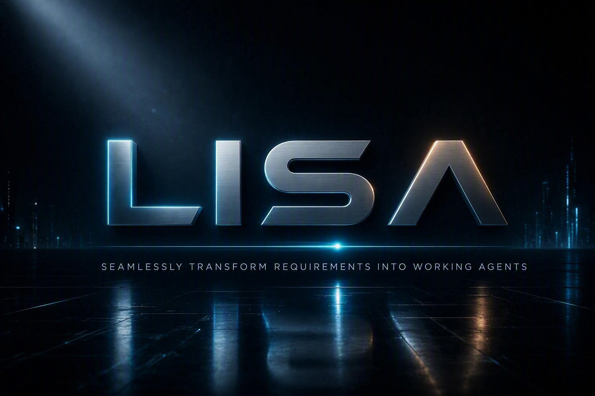

# LISA — Low code Intelligent System Architect

<p align="center">
  
</p>

LISA turns customer requirements into designed, built, evaluated, and published Microsoft agent
solutions — while keeping explicit human review and safety gates on every consequential decision
and remote change.

> [!IMPORTANT]
> LISA is not a read-only documentation tool. A complete run can create or update cloud resources,
> exercise a deployed agent, upload files to SharePoint, and — only after explicit consent — delete
> local output. Review the platform guide for your host before starting.

## What LISA does

LISA packages eleven skills: ten **Copilot Agent Delivery (CAD)** lifecycle skills plus the
standalone, explicitly invoked `video-generator`.

| # | Stage | Skill | Produces |
|---|---|---|---|
| 1 | Analysis | `requirement-analyzer` | Traceable analysis and a structured evidence ledger |
| 2 | Classification | `complexity-classifier` | Solution design, buildable coverage, complexity |
| 3 | Design | `solution-designer` | Architecture and sequence diagrams |
| 4 | Build | `agent-builder` | The built agent, package, and evidence |
| 5 | Evaluation | `agent-evaluator` | Test results, scores, deployment gate |
| 6 | Optimization | `agent-optimizer` | Instruction improvements with rollback safety |
| 7 | Artifacts | `artifact-generator` | Final document and execution tree |
| 8 | Publication | `artifact-publisher` | Verified SharePoint publication |
| 9 | Cleanup | `postpublish-cleanup` | Consented local output removal |

`cad-orchestrator` routes the full lifecycle. Every stage resolves its paths from
`lisa-config.json`, checkpoints its progress, and validates its outputs against packaged artifact
contracts before the next stage can start.

**Human gates are mandatory.** Classification and build require an explicit decision, publication
requires fresh remote verification, and cleanup requires the exact phrase `DELETE OUTPUT`.

## Choose your platform

LISA runs on three hosts. Pick one and follow its guide.

| Platform | Who it is for | Guide |
|---|---|---|
| **Microsoft Scout Desktop** | Scout users running LISA as local skills | [scout/README.md](scout/README.md) |
| **GitHub Copilot CLI** | Anyone with an active GitHub Copilot plan | [github-copilot-cli/README.md](github-copilot-cli/README.md) |
| **Microsoft Agency** | Internal Microsoft only, via its Copilot or Claude engine | [github-copilot-cli/README.md](github-copilot-cli/README.md) |

GitHub Copilot CLI and Microsoft Agency share the same plugin distribution in
[github-copilot-cli](github-copilot-cli). Scout uses the skill set in [scout/m-skills](scout/m-skills).

## Quick start

Run the common installer from the repository root. It asks which platform to target, then checks
and installs only what that platform needs.

```powershell
# Read-only assessment; changes nothing.
powershell.exe -ExecutionPolicy Bypass -File .\Install-LISA-Prerequisites.ps1 -WhatIf

# Interactive installation.
powershell.exe -ExecutionPolicy Bypass -File .\Install-LISA-Prerequisites.ps1
```

Skip the prompt with `-Platform Scout`, `-Platform CopilotCli`, or `-Platform Agency`.
Use `-ProjectPath "C:\Projects\MySolution"` to choose a project location, or `-SkipProjectSetup`
to install the skills/plugin without creating a project. Existing configuration, inputs, outputs,
and checkpoints are preserved. New projects receive a copy of the common root configuration.

Then:

1. Review the project's `lisa-config.json` and complete its tenant values. For manual setup, copy
  the root template only if the project does not already have a config.
2. Put customer source material in `requirements/` and source-grounded tests in `evalData/`.
3. Authenticate PAC CLI and your browser to the same tenant.
4. Start your host from the project folder and invoke `/cad-orchestrator`.

## Repository layout

```text
LISA\
|-- README.md                        Common overview (this file)
|-- lisa-config.json                 Common project configuration template
|-- requirements.txt                 Common prerequisite manifest for all platforms
|-- Install-LISA-Prerequisites.ps1   Common platform-aware installer
|-- github-copilot-cli\              Plugin for GitHub Copilot CLI and Microsoft Agency
|   |-- README.md
|   |-- plugin.json
|   `-- skills\
`-- scout\                           Microsoft Scout Desktop distribution
    |-- README.md
    |-- m-skills\
    |-- m-automations\
    `-- m-mcp-servers.json
```

## Shared configuration

Every platform reads the same `lisa-config.json` shape. Keep project data outside the installed
distribution, one project directory per solution. The common template uses `basePath: "."`, which
resolves relative to the configuration file, not the installed plugin or current shell directory:

```text
<project>\
|-- lisa-config.json
|-- requirements\
|-- evalData\
`-- output\
```

Set `custName`, `timeZone`, `basePath`, `knowledgeSources`, the Copilot Studio environment URL and
ID, and the SharePoint site with its **Agent Library** and **Agent Artifact** libraries. Use one
customer scenario per project run, and never store credentials or tokens in the configuration.

## Requirements

`requirements.txt` is the common manifest for all platforms. Entries marked `[SCOUT ONLY]` apply to
Microsoft Scout Desktop, and `[PLUGIN ONLY]` entries apply to GitHub Copilot CLI and Microsoft
Agency. Shared prerequisites include Windows 11, Python 3.11+, Node.js 20+, PowerShell 7+, Microsoft
Edge, and — for cloud stages — the modern Power Platform CLI with a matching tenant identity.

```powershell
python -m pip install --upgrade -r requirements.txt
```

The plugin carries matching base Python requirements and a matching config template for standalone
GitHub installs, where the repository root is not downloaded. Tests check that these copies agree.
Both setup paths use the same runtime checker for Python, PowerShell, Node.js, npm, and npx.

## Scope and limits

- The distribution is Windows-oriented and builds agents in **Microsoft Copilot Studio** across its
  Standard, GitHub Copilot, and Copilot chat harnesses. For **Microsoft Cowork**, LISA builds skills
  only and ends as a documented handoff.
- No host replaces tenant authentication, licensing, permissions, or human approval.
- A failed validation, blocked stage, rejected review, or unverified publication stops the workflow
  without discarding completed work or remote resources.

## Further reading

- [Microsoft Scout Desktop guide](scout/README.md)
- [GitHub Copilot CLI and Agency plugin guide](github-copilot-cli/README.md)
- [Skill suite reference](github-copilot-cli/skills/README.md)

## Governance and support

LISA is community-maintained with draft governance status, not a Microsoft-supported product.
See [governance and release policy](GOVERNANCE.md), [contributing and local checks](CONTRIBUTING.md),
[security reporting](SECURITY.md), [support](SUPPORT.md), and the [changelog](CHANGELOG.md).
Original LISA code is [MIT licensed](LICENSE); bundled third-party materials retain their own terms.
