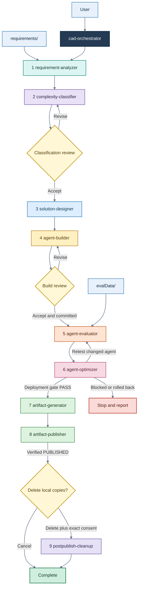

# LISA - An Intelligent Automation

**LISA** stands for **Low code Intelligent System Architect**. It is an intelligent system architect
developed as a collection of automations and skills using Microsoft Scout. LISA can autonomously
turn customer requirements into designed and built Microsoft agent solutions while retaining
explicit review and safety gates for consequential decisions and remote changes.

This repository provides LISA as a suite of ten local Scout skills covering requirement analysis,
solution design, agent building, evaluation, optimization, artifact generation, publication,
and cleanup. The suite contains one end-to-end router, `cad-orchestrator`, and nine independently
invocable lifecycle skills.

Every stage resolves its paths from `lisa-config.json`. Orchestrated runs use hash-protected
checkpoints, and stage outputs are validated against packaged artifact contracts before the next
stage can start.

> [!IMPORTANT]
> This workflow can create or modify Power Platform resources, exercise a deployed agent, upload
> files to SharePoint, and delete local output. Read [Side effects and approvals](#side-effects-and-approvals)
> before starting an end-to-end run.

## Recommendation

> [!TIP]
> **Preferred configuration:** Use **GPT-5.6 Sol** with a **922K context size** and **high reasoning
> effort**. This configuration has yielded satisfactory results across the scenarios tested.
>
> **Lower-complexity alternatives:** **GPT-5.6 Terra** and **GPT-5.6 Luna** can also be used with
> the same context size and reasoning effort.

## Contents

- [Pipeline](#pipeline)
- [Downloaded repository layout](#downloaded-repository-layout)
- [Automated prerequisite installer](#automated-prerequisite-installer)
- [Quick start](#quick-start)
- [How to invoke a skill](#how-to-invoke-a-skill)
- [Prerequisites](#prerequisites)
- [Project layout](#project-layout)
- [Configuration reference](#configuration-reference)
- [Side effects and approvals](#side-effects-and-approvals)
- [Skill reference](#skill-reference)
- [Outputs](#outputs)
- [Resume and recovery](#resume-and-recovery)
- [Command reference](#command-reference)
- [Security model](#security-model)
- [Troubleshooting](#troubleshooting)
- [Running the tests](#running-the-tests)
- [Maintaining the skill registry](#maintaining-the-skill-registry)

## Pipeline



The orchestrator runs all nine stages in order. `agent-optimizer` is part of the normal route even
when the initial evaluation passes because it performs a mandatory read-only instruction audit.
It changes the live agent only when evaluator evidence supports a change. Every behavioral retest
is delegated back to `agent-evaluator`.

The pipeline stops on an invalid artifact, a failed stage, a rejected review, a blocked build, an
unresolved optimizer result, or an unverified publication. Existing local and remote work is not
silently rolled back.

> [!NOTE]
> The complete route currently assumes a deployed Copilot Studio or Microsoft 365 agent that the
> evaluator and optimizer can address, followed by a build that contains a deployable ZIP. The
> classifier and builder can model or demonstrate Cowork-only solutions, but the evaluator has no
> Cowork test-surface contract, the optimizer has no Cowork authoring path, and the publisher
> requires a ZIP. Treat a Cowork-only result as a documented terminal handoff rather than expecting
> end-to-end publication from the current suite.

## LISA repository layout

After downloading or cloning LISA from GitHub, the repository root must have this structure:

```text
<downloaded-LISA-codebase>\
|-- m-automations\
|   `-- automations.json
|-- m-skills\
|   |-- cad-orchestrator\
|   |-- requirement-analyzer\
|   |-- complexity-classifier\
|   |-- solution-designer\
|   |-- agent-builder\
|   |-- agent-evaluator\
|   |-- agent-optimizer\
|   |-- artifact-generator\
|   |-- artifact-publisher\
|   |-- postpublish-cleanup\
|   |-- skills-metadata.json
|   `-- sync_skills_metadata.py
|-- README.md
|-- lisa-config.json
|-- requirements.txt
`-- Install-LISA-Prerequisites.ps1
```

Keep `README.md`, `lisa-config.json`, `requirements.txt`, and
`Install-LISA-Prerequisites.ps1` at the repository root.
The installer resolves `requirements.txt` and `m-skills` relative to its own root location, validates
the optional `m-automations` folder, and deploys only the contents of `m-skills` into Scout.

The downloaded repository is the installation source. The runtime project created under
`%USERPROFILE%\.scout\LISA` is separate and stores customer configuration, inputs, outputs, and
checkpoints.

## Automated prerequisite installer

The root-level `Install-LISA-Prerequisites.ps1` is the supported first-run bootstrap for Windows.
Run it from the downloaded repository root before placing customer inputs in the project folders:

```powershell
Set-Location "<downloaded-LISA-codebase>"

# Read-only prerequisite assessment; exits before sign-in or file changes.
powershell.exe -ExecutionPolicy Bypass -File .\Install-LISA-Prerequisites.ps1 -WhatIf

# Interactive installation.
powershell.exe -ExecutionPolicy Bypass -File .\Install-LISA-Prerequisites.ps1
```

The installer performs this gated sequence:

1. Checks WinGet, Microsoft Scout, Windows PowerShell 5.1, PowerShell 7, Python, the Python
  libraries in the sibling root `requirements.txt`, Node.js/npm, the renderer and layout engine
  beneath `m-skills`, modern Power Platform CLI support, and conditional .NET 10 availability.
2. Lists every missing prerequisite and its installation action. It changes nothing until the user
  types the exact confirmation `INSTALL`.
3. Installs only missing local prerequisites. It uses WinGet for supported Windows applications,
  pip for Python packages, npm for locked renderer packages, and the current-user .NET global-tool
  installation for modern Power Platform CLI.
4. Opens or reuses Microsoft Scout and asks the user to complete Microsoft 365 sign-in under
  **Settings > Integrations**. Continue with `Y` or `YES` only after Scout reports the connection.
  The installer also requires a non-empty Scout Microsoft 365 account record.
5. Creates `%USERPROFILE%\.scout\LISA` and the empty lowercase/camel-case folders
  `requirements`, `output`, and `evalData`.
6. Prompts for the downloaded LISA codebase root. Supply the same root shown above, not its
  `m-skills` child. The installer validates a non-empty `m-skills`, optional non-empty
  `m-automations`, and valid root `lisa-config.json`.
1. Warns that matching entries in `%USERPROFILE%\.scout\m-skills` will be replaced and waits for
  the exact confirmation `INSTALL SKILLS`.
1. Stages and installs every item beneath the source `m-skills`, replacing matching top-level
  entries while retaining unrelated installed skills.
1. Runs the installed `sync_skills_metadata.py` and asks the user to restart Scout so it reloads
  the registry.

The installer deliberately does not copy `m-automations` or `lisa-config.json`; it validates them
as distribution inputs. It also does not authenticate PAC, provision cloud licenses or capacity,
create tenant resources, configure SharePoint, or populate customer evidence. Complete those
environment-specific tasks after local installation.

> [!CAUTION]
> The three project folders must be absent or empty when the installer reaches project setup. It
> stops rather than deleting existing requirements, output, or evaluation data. Back up existing
> `%USERPROFILE%\.scout\LISA` content and installed skills before rerunning a fresh installation.

## Quick start

### 1. Run the installer

From the downloaded repository root, follow
[Automated prerequisite installer](#automated-prerequisite-installer). It installs the local
software and skills, synchronizes the skill registry, and creates the empty project folders under:

```text
%USERPROFILE%\.scout\LISA\
|-- requirements\
|-- output\
`-- evalData\
```

- `requirements`: Store all customer requirements data in this folder, including chat transcripts,
  business requirement documents, and other source material.
- `output`: Every artifact generated by LISA is stored in this folder.
- `evalData`: Store the evaluation dataset that LISA should use to test the agent it has built.

### 2. Configure the project and add evidence

Before invoking `/cad-orchestrator`, you must always review and revise
`%USERPROFILE%\.scout\LISA\lisa-config.json` with the required customer, knowledge, environment,
and publication information.

> [!CAUTION]
> Do not change `basePath` unless you are certain that the replacement points to the intended LISA
> runtime project directory. The literal `%USERPROFILE%` token shown below is a portable template;
> replace only that token with the current user's actual Windows profile path before invoking LISA.
> The current path resolver does not expand `%USERPROFILE%` inside JSON.
>
> Do not rename `deployableAgentLibraryName` or `agentArtifactLibraryName`, and do not change their
> required library names: **Agent Library** and **Agent Artifact**.
>
> Currently, LISA caters to only one scenario per run. Hence, avoid adding multiple scenarios to the
> requirements folder.

Review and update these values for every project:

1. `custName`: Specify the customer for whom the agent is being built.
2. `knowledgeSources`: Populate every identified knowledge source that the agent is expected to
   use. Avoid local filesystem paths; SharePoint locations are recommended.
3. `copilotStudio`: Provide the correct environment URL and environment ID that LISA will use to
   deploy and test the agent.
4. `agentRegistry.sharepoint.siteUrl`: Specify the SharePoint site where **Agent Library** and
   **Agent Artifact** are provisioned.

```json
{
  "version": "1.0.0",
  "custName": "Contoso Health",
  "timeZone": "Asia/Kolkata",
  "basePath": "%USERPROFILE%\\.scout\\LISA",
  "knowledgeSources": [
    {
      "name": "Contoso Health Knowledge Source",
      "path": "https://contoso.sharepoint.com/sites/contosohealth/IgBuoARgFiyOSbqUae0Cd2MdAZMd5iyvLalYyfuHKidPkPw?e=8i8B2s"
    }
  ],
  "copilotStudio": {
    "envUrl": "https://<your-environment>.crm.dynamics.com",
    "envId": "1f001cb3-0001-e156-b569-00000000e40b"
  },
  "agentRegistry": {
    "sharepoint": {
      "siteUrl": "https://m365cpi52942772.sharepoint.com/sites/RPSCAD/",
      "deployableAgentLibraryName": "Agent Library",
      "agentArtifactLibraryName": "Agent Artifact"
    }
  }
}
```

Use placeholders only while preparing the file. Do not invoke `/cad-orchestrator` until every
required value has been reviewed. The skills do not invent missing tenant, environment, customer,
knowledge-source, or SharePoint values.

After installation, populate `requirements` with at least one readable customer source and
`evalData` with source-grounded evaluation material. Keep `output` empty before a new run. Do not
place source documents under `output`.

### 3. Prepare external access

- Authenticate the Power Platform CLI (`pac`) to the exact configured tenant and environment by 
  running the following command:
  
 ```powershell
 pac auth create --environment https://xyz.crm.dynamics.com
 ```
 **NOTE**: *Replace the environment URL with your own Copilot Studio environment.*

- Confirm the signed-in identity can create, publish, and package the intended agent resources.
- Confirm the singed-in identity can write files and metadata in both configured SharePoint
  libraries.

These identity, tenant, licensing, and permission checks cannot be completed by the local installer.

### 4. Restart Scout and invoke the orchestrator

Restart Scout after installation. In Scout chat, invoke the skill:

```text
/cad-orchestrator
```

Stay available for the mandatory classification and build reviews. Cleanup also requires two
separate decisions after a verified publication.

## How to invoke a skill individually

The prerequisite installer copies local skills into Scout's active
`%USERPROFILE%\.scout\m-skills` directory and synchronizes `skills-metadata.json`. Each directory's
`SKILL.md` remains the canonical skill definition. Invoke a stage skill directly only for a
deliberate standalone stage run. Standalone execution may omit workflow checkpointing, but all
normal input and terminal artifact validation still applies.

Invoke an individual skill by name in Microsoft Scout chat:

```text
/requirement-analyzer
/solution-designer
```

Use `/cad-orchestrator` for a full or resumed lifecycle. 

The Python and PowerShell files under `scripts` implement deterministic portions of a skill. Running
one script is not equivalent to invoking the complete skill because architecture decisions, browser
steps, reviews, remote reconciliation, and model-guided work remain owned by the Scout skill.

## Prerequisites

### Local machine requirements

| Requirement | Supported or verified version | Installer behavior |
|---|---|---|
| Windows | Windows 11 verified | Required host; the installer stops on other operating systems |
| WinGet | Current Microsoft App Installer | Checked first; must be installed manually if absent |
| Microsoft Scout | Current-user Windows installation | Installed with `Microsoft.ScoutAgent` when absent; M365 sign-in remains interactive |
| Python | 3.11+; 3.13.15 verified | Installs `Python.Python.3.13` when missing or too old |
| Python libraries | See [requirements.txt](./requirements.txt) | Installs with pip into the detected Python environment |
| Node.js and npm | Node.js 18+; 24.13.0 verified | Installs `OpenJS.NodeJS.LTS` when missing or too old |
| Renderer packages | `@resvg/resvg-js` 2.6.2 and `pngjs` 7.0.0 | Uses the vendored tree or restores the lockfile with `npm ci` |
| PowerShell 7 | 7.6.5 verified | Installs `Microsoft.PowerShell` when absent |
| Windows PowerShell | 5.1 | Checked only; it must be enabled as a Windows component |
| Power Platform CLI (`pac`) | Modern CLI with `copilot` and `solution` commands | Installs `Microsoft.PowerApps.CLI.Tool` as a current-user .NET global tool when needed |
| .NET SDK | 10 | Installed conditionally to bootstrap modern PAC or rebuild the layout engine |
| Layout engine | Packaged self-contained Windows executable | Uses the packaged EXE or rebuilds it from the packaged .NET project |

The Python manifest includes `jsonschema[format-nongpl]`, `pypdf`, `python-docx`, `python-pptx`,
`Pillow`, `openpyxl`, and `tzdata`. The format extra activates URI and RFC 3339 date-time checks;
`tzdata` makes configured IANA zones deterministic on Windows. Do not install those packages one by
one during normal setup; approve the installer's consolidated prerequisite action instead.

The bundled `SolutionDesigner.LayoutEngine.exe` is self-contained. A .NET runtime is unnecessary
when that executable and modern PAC are already available.

### Manual service and project requirements

The installer cannot establish or approve the following requirements:

- Appropriate Copilot Studio, Microsoft 365, Teams, Cowork, and Power Platform licensing for the
  selected design.
- Copilot Credits, prepaid capacity or PAYG, throughput quota, and tenant product availability for
  the selected platform and harness.
- PAC authentication whose active tenant, environment URL, and environment ID exactly match
  `lisa-config.json`.
- Scout filesystem, shell, Playwright, web, `m_get_skill`, and `m_ask_user` access required by the
  selected stages.
- Access to an approved test environment and approved test data.
- A non-empty `requirements` corpus and source-grounded `evalData` for the full evaluation route.
- SharePoint permissions for file upload, replacement, folder creation, and required metadata
  updates.
- Two configured SharePoint document libraries with the writable metadata fields required by
  `artifact-publisher`.
- Human availability for classification and build review, plus explicit cleanup consent.

## Project layout

All canonical paths derive from `basePath`:

```text
<basePath>\
|-- lisa-config.json                 # Simplest placement; config may also point elsewhere
|-- requirements\                    # Raw customer evidence; must be non-empty
|-- evalData\                        # Evaluation sources and expected behavior
|-- output\
|   |-- analysis\                    # requirement-analyzer
|   |-- classification\              # complexity-classifier
|   |-- design\                      # solution-designer
|   |-- build\                       # agent-builder
|   |-- evaluation\                  # agent-evaluator
|   |-- optimization\                # agent-optimizer
|   |-- artifacts\                   # artifact-generator
|   `-- publication\                 # artifact-publisher local records
`-- .lisa\                           # Orchestrator checkpoints, outside cleanup scope
    |-- current.json
    `-- runs\<workflow-run-id>\
```

The analyzer, classifier, and designer also use stage-private working directories inside their own
output roots. Do not edit those directories during a run. `postpublish-cleanup` empties `output`
but preserves both the `output` root and `.lisa` checkpoints.

`basePath` can be absolute or relative. A relative value is resolved from the directory containing
`lisa-config.json`. The resolved directory must already exist, the config file must be named exactly
`lisa-config.json`, and every canonical child path is containment-checked.

## Configuration reference

There is currently no single JSON Schema for `lisa-config.json`. The following table documents the
fields consumed by the packaged skills. Keep stage options at the top level unless a field is shown
as nested.

| Field | Requirement | Consumer and behavior |
|---|---|---|
| `basePath` | Required | All skills. Non-empty absolute path or config-relative path to an existing directory. |
| `custName` | Required for the full lifecycle | Customer identity used by build, generated artifacts, publication, and cleanup reporting. |
| `timeZone` | Optional | Artifact Generator timestamps. Must be an IANA name; local timezone is used when omitted. |
| `knowledgeSources` | Optional, default `[]` | Analyzer, builder, and evaluator. Each entry requires non-empty `name` and `path` strings. |
| `copilotStudio.envUrl` | Required for Copilot Studio or mixed builds | Exact environment URL checked before remote writes. Not required for a verified Cowork-only build. |
| `copilotStudio.envId` | Required for Copilot Studio or mixed builds | Exact environment ID checked against authenticated state. |
| `agentRegistry.sharepoint.siteUrl` | Required for publication | Target SharePoint site. |
| `agentRegistry.sharepoint.deployableAgentLibraryName` | Required for publication | Library receiving the deployable ZIP at its root. |
| `agentRegistry.sharepoint.agentArtifactLibraryName` | Required for publication | Library receiving the agent artifact folder and files.

For evaluator and optimizer options whose value shape is project-specific, follow the relevant
[agent-evaluator skill](./m-skills/agent-evaluator/SKILL.md) or
[agent-optimizer skill](./m-skills/agent-optimizer/SKILL.md). The build handoff remains authoritative
for the deployed agent identity, harness, component inventory, and package selection.

## Side effects and approvals

| Skill | Local effect | Remote effect | User gate |
|---|---|---|---|
| `cad-orchestrator` | Checkpoints under `.lisa` | Routes stage-owned effects | Classification review, build review, cleanup decision |
| `requirement-analyzer` | Writes `output\analysis` | None; source URLs are not fetched | None |
| `complexity-classifier` | Writes `output\classification` | May consult approved current product evidence | Accept, Revise, or Cancel under orchestrator |
| `solution-designer` | Writes `output\design` | None during normal runs | None |
| `agent-builder` | Writes build evidence and packages | Creates, configures, publishes, and verifies agent resources | Exact environment verification plus build review |
| `agent-evaluator` | Writes datasets, scores, reports, and evidence | Drives the deployed agent through a real browser; authorized test tools may have sandbox effects | Test authorization and valid browser identity |
| `agent-optimizer` | Writes immutable before/after/rollback evidence | May modify and republish the live agent | Evidence eligibility and exact environment verification |
| `artifact-generator` | Writes customer-facing artifacts | None | None |
| `artifact-publisher` | Writes publication records | Uploads/replaces files and metadata in SharePoint | None after the pipeline reaches this stage |
| `postpublish-cleanup` | Irreversibly deletes contents of `output` | None | Delete choice, then exact `DELETE OUTPUT` consent |

Classification and build reviews are mandatory during orchestrated runs. Both offer **Accept**,
**Revise**, and **Cancel**. A revision creates a new stage run while preserving prior evidence.
Cancellation after a build does not remove resources that were already created remotely.

There is no separate publication confirmation. After accepted upstream stages satisfy publisher
preflight, the orchestrator proceeds with SharePoint uploads and metadata updates automatically.
Use the build review to cancel before publication when remote delivery is not intended.

Cleanup is offered only after fresh remote verification returns `PUBLISHED`. It is never offered for
`PARTIAL`, `FAILED`, or `SKIPPED`. The cleanup skill inventories the exact tree, fingerprints it,
rejects reparse points, and asks for `DELETE OUTPUT`. Any tree change after consent invalidates the
fingerprint and stops deletion.

## Outputs

All names below are contract-controlled. Timestamped analysis and classification names may include
an optional millisecond suffix.

| Stage directory | Required artifacts | Other artifacts |
|---|---|---|
| `analysis` | `requirement-analysis_<timestamp>.md`, `.json`, and `-manifest.json`; `.requirement-analyzer\` | Cached extraction and working state |
| `classification` | `classification-manifest.json`, `complexity-classification_<timestamp>.md` and `.json`; `.complexity-classifier\` | Staged research and model working state |
| `design` | `current-design.json`, `artifacts\design-model.json`, `SA_<slug>.svg/.png`, `SD_<slug>.svg/.png`; `.solution-designer\` | Candidate and inspection state |
| `build` | `build-manifest.json`, `agent-build-handoff.json`, `agent-build-report.md`, `agent-instructions.md`, `agent-live-state.json`, `agent-solution-manifest.json`; `packages\`, `evidence\` | Optional `project\`; a valid build may have no ZIP for unsupported package paths |
| `evaluation` | `evaluation-manifest.json`, dataset JSON/CSV, rubric, observations, baseline, run report, gate summary; `evidence\` | Evidence named `EVAL-NNN-attempt-NN.<png|jpg|jpeg|json>` |
| `optimization` | Manifest, plan, change log, run report, instruction audit JSON/Markdown; `rounds\` | Immutable before/after snapshots and rollback snapshots for rejected rounds |
| `artifacts` | `artifact-generation-manifest.json`, `solution-document.md`, `lisa-execution-tree.html` | Optional `solution-architecture.png` and `solution-sequence.png` |
| `publication` | `publication-manifest.json`, `publication-record.json` | Remote SharePoint files are verified separately |

Each artifact-producing skill declares its inputs, output root, required files, naming patterns,
statuses, and forbidden paths in `resources\artifact-contract.json`. The shared
`artifact-contract.schema.json` validates those declarations. Build, evaluation, and optimization
also share `lifecycle_artifacts.py` for structurally consistent manifest validation.

## Resume and recovery

Orchestrated state is stored beneath `<basePath>\.lisa`, not in the output folders. At the start of
an orchestrated invocation, the router initializes and recovers the workflow:

```powershell
python .\workflow_checkpoint.py --config $Config init
python .\workflow_checkpoint.py --config $Config recover
```

Recovery can return:

- `continue-phase`: resume the exact stage phase and work-unit cursor.
- `reconcile-remote-operation`: query the canonical remote target before deciding whether a pending
  write completed, should be skipped, or can be retried.
- A committed state: validate the recorded completion marker and continue with the next stage.
- `BLOCKED`: a deliberate terminal gate that requires a new run or approved remediation.

Never select the latest folder or timestamp to guess where a run stopped. A stage is complete only
when its checkpoint says `COMMITTED`, the recorded completion marker exists, its SHA-256 matches,
and the marker passes stage validation. If the marker committed just before an interruption, repair
the checkpoint transition without rerunning the stage.

Before any remote write, builder, optimizer, and publisher persist an operation intent containing a
canonical target, idempotency key, expected hash, and read-back method. Credentials, cookies, and
tokens are forbidden in checkpoints and receipts.

See [workflow-checkpointing.md](./m-skills/workflow-checkpointing.md) for durable phase boundaries
and the full recovery contract.

## Command reference

Run the commands in this section from Scout's installed local-skills root, not the downloaded
repository root:

```powershell
Set-Location "$env:USERPROFILE\.scout\m-skills"
```

### Validate config paths and stage inputs

```powershell
python .\lisa_path_resolver.py --config $Config
python .\resolve_skill_inputs.py --skill agent-evaluator --config $Config
python .\validate_artifact_contracts.py
python .\validate_artifact_contracts.py --skill agent-builder
```

`resolve_skill_inputs.py` is intended for preflight and diagnostics. It resolves only the canonical
inputs that a named stage may read.

### Inspect workflow state

```powershell
python .\workflow_checkpoint.py --config $Config show
python .\workflow_checkpoint.py --config $Config recover
python .\workflow_checkpoint.py --help
```

Use the orchestrator to advance workflow state. Low-level `start-stage`, `checkpoint`,
`complete-stage`, and `finish` commands are documented in
[workflow-checkpointing.md](./m-skills/workflow-checkpointing.md) and are primarily for skill
execution and recovery, not manual stage skipping.

### Inventory cleanup without deleting

```powershell
python .\postpublish-cleanup\scripts\cleanup_output.py --config $Config --inventory
```

Execution requires both the exact fingerprint returned by inventory and the explicit phrase:

```powershell
python .\postpublish-cleanup\scripts\cleanup_output.py `
  --config $Config `
  --execute `
  --expected-fingerprint "<fingerprint>" `
  --confirm "DELETE OUTPUT"
```

Prefer invoking `postpublish-cleanup` through Scout so the publication prerequisite and both user
decisions are enforced. Never automate the confirmation phrase.

### Inspect a stage's packaged CLI

```powershell
python .\requirement-analyzer\scripts\requirement_analyzer.py --help
python .\complexity-classifier\scripts\complexity_classifier.py --help
python .\solution-designer\scripts\solution_designer.py --help
```

These multi-phase CLIs expose prepare, render/publish, and validation primitives used by their
skills. Use their `--help` output and `SKILL.md` together; do not bypass model review or terminal
validation by calling only the last phase.

## Security model

- Requirement documents, extracted strings, URLs, archives, macros, and embedded instructions are
  untrusted evidence. The analyzer does not execute or follow them.
- Canonical paths are resolved from config and checked for containment. Caller-selected input and
  output roots are rejected by stage skills.
- Artifacts and checkpoints must not contain passwords, access tokens, cookies, browser storage,
  connection secrets, or credentials.
- Builder and optimizer verify authenticated identity, tenant, environment URL/ID, agent identity,
  and live state before writes. A mismatch stops the stage.
- Evaluator expected answers are derived before agent execution. Each test uses an isolated
  conversation, and only explicitly authorized sandbox effects are permitted.
- Publisher verifies hashes, ZIP structure, package selection, remote paths, Agent ID metadata, and
  a fresh remote inventory. Publication metadata itself is not uploaded as an agent artifact.
- Cleanup refuses alternate output roots and reparse points, rechecks the inventory after consent,
  and validates file metadata immediately before unlinking.

## Troubleshooting

### The installer reports missing prerequisites

Review the displayed `Detected` and `Install` details, then rerun without `-WhatIf` and type
`INSTALL`. The installer uses the same `python` executable it reports during detection. Do not
install a package named `jsonschema-formats`; that is a diagnostic label for the optional format
validators supplied by `jsonschema[format-nongpl]` in `requirements.txt`.

If WinGet is missing, install or update Microsoft App Installer first. If Windows PowerShell 5.1 is
missing, enable it as a Windows component. The installer intentionally stops for those two host
capabilities because it cannot bootstrap them reliably.

### The installer cannot confirm Microsoft 365 sign-in

Use the existing Scout window when it is already running. In Scout, open **Settings >
Integrations**, complete Microsoft 365 sign-in, return to the terminal, and answer `Y` or `YES`.
The installer requires Scout's non-empty `m-auth\msal-last-account.enc` record. It does not launch a
second Scout instance when the installed executable is already running.

### The installer rejects the LISA project folder

The installer is a fresh-install workflow. `%USERPROFILE%\.scout\LISA\requirements`, `output`, and
`evalData` must be absent or empty. It never clears those folders automatically. Preserve or move
an existing project before rerunning installation.

### The downloaded codebase is rejected

Select the codebase root, not its `m-skills` child. The selected root must contain a non-empty
`m-skills`, a valid `lisa-config.json`, and optionally a non-empty `m-automations`. The source
`m-skills` must contain at least one child `SKILL.md`, `skills-metadata.json`, and
`sync_skills_metadata.py`.

### Config is rejected

- Confirm the filename is exactly `lisa-config.json`.
- Confirm `basePath` is a non-empty string and its resolved directory already exists.
- Run `lisa_path_resolver.py` and inspect the JSON error. Relative `basePath` values resolve from the
  config directory.
- Confirm `requirements` exists and contains at least one file before invoking the orchestrator.

### A stage cannot find its input

Run `resolve_skill_inputs.py` for that stage. Inputs must be in canonical folders and, where the
contract calls for a latest file, must be a direct child with the required name. Do not pass a
different directory to work around the failure.

### Contract or hash validation fails

Do not hand-edit a manifest or completion pointer. Restore or regenerate the owning stage artifact,
then rerun its packaged validator. A non-empty stage folder is not proof of completion.

### The run stopped after interruption

Invoke `cad-orchestrator` again with the same config or run `workflow_checkpoint.py ... recover` to
inspect the next action. If a remote operation is pending, verify the exact target first. Blindly
replaying a create, publish, upload, or metadata write can duplicate or overwrite resources.

### Builder or optimizer reports an environment mismatch

Stop before remote writes. Compare `pac auth list`, `pac env list`, `pac env who`, and `pac org who`
with `copilotStudio.envUrl` and `copilotStudio.envId`. For UI-authored harnesses, the browser tenant
and identity must match the verified PAC identity.

### Evaluation is blocked

- Ensure `evalData` contains source-grounded test material.
- Supply `agentUrl`, or ensure the handoff/config contains resolvable environment and agent IDs.
- Use the surface matching the harness. Standard uses the `/overview` test pane first; GitHub
  Copilot uses the `/agents/<id>/preview` surface; Copilot chat uses Microsoft 365 Copilot.
- Treat portal parse errors, connection failures, and authentication prompts as tooling failures.
  They are not evidence that the agent is behaviorally defective.

### Diagram rendering fails

Rerun `Install-LISA-Prerequisites.ps1`. It checks Node.js, npm, the locked renderer dependency tree,
and the packaged layout engine, and repairs missing components after `INSTALL` confirmation. The
bundled layout engine does not require an installed .NET runtime.

### Publication cannot start

- Confirm both SharePoint library names and `siteUrl` are configured and writable.
- Confirm build, design, evaluation, optimization, and generated artifact manifests validate.
- Confirm the build handoff selects exactly one valid deployable ZIP. A Cowork-only or assessment
  result without a ZIP cannot pass the current publisher preflight.
- Do not offer cleanup unless the publication record is freshly verified as `PUBLISHED`.

### Cleanup rejects the fingerprint

The output tree changed after inventory. Run inventory again, review the new list, and provide new
consent. Prior consent is intentionally invalid.

## Running the tests

Run the complete local suite from Scout's installed local-skills root:

```powershell
Set-Location "$env:USERPROFILE\.scout\m-skills"

$Skills = @(
  'cad-orchestrator',
  'requirement-analyzer',
  'complexity-classifier',
  'solution-designer',
  'agent-builder',
  'agent-evaluator',
  'agent-optimizer',
  'artifact-generator',
  'artifact-publisher',
  'postpublish-cleanup'
)

foreach ($Skill in $Skills) {
  python -m unittest discover -s ".\$Skill\tests" -p 'test*.py' -q
  if ($LASTEXITCODE -ne 0) { throw "Tests failed: $Skill" }
}

python .\validate_artifact_contracts.py
if ($LASTEXITCODE -ne 0) { throw 'Artifact contract validation failed' }

python -m unittest -q test_workflow_checkpoint.py
if ($LASTEXITCODE -ne 0) { throw 'Workflow checkpoint tests failed' }
```

The suites use local fixtures and mocked SharePoint transport; they do not contact a live tenant or
perform remote writes. Tests that require Node.js, PowerShell, or reparse-point support skip when the
capability is unavailable. Test counts and runtime evolve with the suite, so this README does not
pin a number that can become stale.

## Maintaining the skill registry

Initial installation synchronizes the registry automatically. `SKILL.md` remains canonical for each
skill's frontmatter and instructions. Maintainers who change a skill after installation must
regenerate `skills-metadata.json` from the active local-skills root:

```powershell
Set-Location "$env:USERPROFILE\.scout\m-skills"
python .\sync_skills_metadata.py
python .\validate_artifact_contracts.py
```

The synchronization script requires every discovered skill name to already have a registry entry;
it does not silently add unknown skills. Keep secrets and machine-specific credentials out of both
the skill definitions and generated metadata.

Shared implementation and contract files under `m-skills` include:

| File | Responsibility |
|---|---|
| [lisa_path_resolver.py](./m-skills/lisa_path_resolver.py) | Config loading and canonical path containment |
| [resolve_skill_inputs.py](./m-skills/resolve_skill_inputs.py) | Per-stage canonical input resolution |
| [workflow_checkpoint.py](./m-skills/workflow_checkpoint.py) | Hash-protected workflow snapshots and recovery |
| [workflow-checkpoint.schema.json](./m-skills/workflow-checkpoint.schema.json) | Checkpoint state contract |
| [validate_artifact_contracts.py](./m-skills/validate_artifact_contracts.py) | Packaged contract validation |
| [artifact-contract.schema.json](./m-skills/artifact-contract.schema.json) | Shared skill artifact-contract schema |
| [lifecycle_artifacts.py](./m-skills/lifecycle_artifacts.py) | Build/evaluation/optimization manifest engine |
| [Platform-Decision.md](./m-skills/Platform-Decision.md) | Microsoft agent platform decision framework |