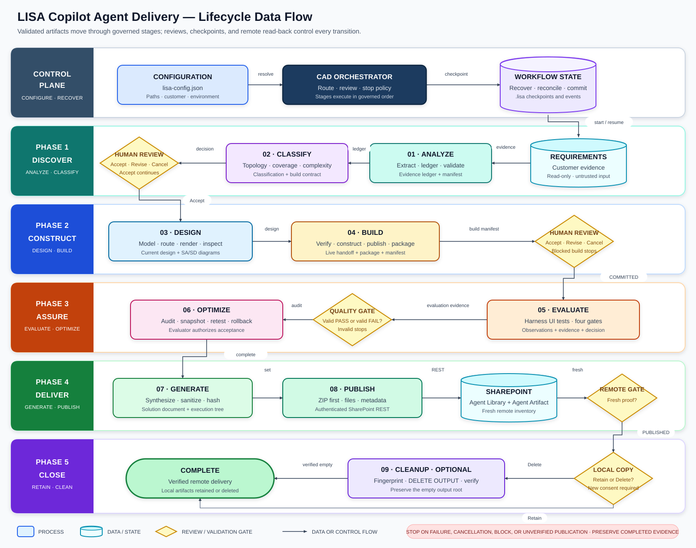

# LISA skill suite

This directory contains the ten local skills that implement the **LISA Copilot Agent Delivery (CAD)** lifecycle. This reference explains what each skill is, what it does, the inputs and outputs it consumes and produces, how it executes, where it runs in the orchestrator, how failure is handled, and how to extend it without regressions.

> [!IMPORTANT]
> A skill is more than the script files in its `scripts/` directory. Some stages combine deterministic scripts with model-guided architecture work, browser interaction, human review, remote-system reconciliation, and checkpointing. Running one script directly does not necessarily execute the complete skill.

## Review scope and evidence levels

All files in this directory were inventoried for this reference. Maintained Markdown, JSON, Python, PowerShell, JavaScript, C#, package metadata, schemas, tests, and fixtures were examined. Packaged SVG icons, the Inter font, and the compiled layout executable were reviewed through their manifests, licenses, calling code, and tests rather than interpreted as source. Generated `.NET` files under `solution-designer/layout-engine/obj/` are build intermediates and are not extension points.

The descriptions below distinguish these implementation levels:

- **Implemented** — packaged code performs and enforces the behavior.
- **Schema/contract-enforced** — JSON Schema or an artifact validator enforces the behavior.
- **Agent-directed** — `SKILL.md` requires the hosting agent to perform the behavior, but no packaged program implements the whole operation.
- **Declarative-only** — policy is documented but is not currently validated or automated.

## End-to-end lifecycle



**How to read the diagram:** this fixed-layout SVG uses Visio-style swimlanes and a left-to-right/right-to-left flow to keep each handoff short. Rectangles are processes, cylinders are data or durable state, and diamonds are review or validation gates. Every transition requires a validated terminal marker and checkpoint commit. Revision returns to its owning stage with a new run ID; optimization retests return to Evaluation. Any cancellation, blocked result, invalid artifact, failed validation, or unverified publication stops the route while preserving completed evidence and remote state.

The orchestrator route is **agent-directed** by [`cad-orchestrator/SKILL.md`](cad-orchestrator/SKILL.md); there is no executable program that automatically runs the full pipeline. The shared checkpoint engine persists position and recovery data, but it does not enforce stage order by itself.

### Stage map

| Order | Skill | Stage | Primary terminal marker | Failure effect |
|---:|---|---|---|---|
| Meta | `cad-orchestrator` | orchestration | Workflow state under `<basePath>/.lisa` | Stops routing; existing local and remote work is preserved. |
| 1 | `requirement-analyzer` | analysis | `requirement-analysis_<timestamp>-manifest.json` | Classification must not start. |
| 2 | `complexity-classifier` | classification | `classification-manifest.json` plus human acceptance | Design must not start. Revision creates a new classification run. |
| 3 | `solution-designer` | design | `current-design.json` | Build must not start; the prior current design remains active. |
| 4 | `agent-builder` | build | `build-manifest.json` plus human acceptance | A validation failure stops the pipeline; a validated `blocked` result is a terminal gate. |
| 5 | `agent-evaluator` | evaluation | `evaluation-manifest.json` | Malformed/missing output stops the pipeline. A valid FAIL decision is evidence for Optimizer, not an execution error. |
| 6 | `agent-optimizer` | optimization | `optimization-manifest.json` | `blocked` or `rolled-back` stops normal delivery and preserves snapshots. |
| 7 | `artifact-generator` | artifacts | `artifact-generation-manifest.json` | Publication must not start. |
| 8 | `artifact-publisher` | publication | `publication-record.json` after fresh remote verification | Never report `PUBLISHED`; partial remote writes remain for reconciliation. |
| 9, optional | `postpublish-cleanup` | cleanup | Empty preserved `<basePath>/output` root and external checkpoint | Report partial deletion safely; never infer completion. |

## Shared configuration, paths, contracts, and recovery

### Canonical project paths

[`lisa_path_resolver.py`](lisa_path_resolver.py) treats an explicitly supplied file named `lisa-config.json` as the path authority. It resolves `basePath` relative to the configuration file or accepts an absolute `basePath`, requires the base directory to exist, rejects child-path traversal, and derives:

```text
<basePath>/
|-- requirements/
|-- evalData/
|-- output/
|   |-- analysis/
|   |-- classification/
|   |-- design/
|   |-- build/
|   |-- evaluation/
|   |-- optimization/
|   |-- artifacts/
|   `-- publication/
`-- .lisa/
    `-- current.json
```

Validate path resolution before a run:

```powershell
python "<m-skills-root>\lisa_path_resolver.py" --config "<path>\lisa-config.json"
```

[`resolve_skill_inputs.py`](resolve_skill_inputs.py) returns canonical inputs for individual stages and prevents caller-selected child paths. It supports Requirement Analyzer through Post-Publish Cleanup, except that `cad-orchestrator` itself has no router entry:

```powershell
python "<m-skills-root>\resolve_skill_inputs.py" --skill agent-builder --config "<path>\lisa-config.json"
```

“Latest” selection is not globally uniform. The shared resolver uses filesystem modification time with filename as a tie-breaker, while parts of publication use filename ordering and internal generators may use timestamp strings. Avoid touching old lifecycle files; preserve immutable stage outputs and rely on current pointers/manifests where available.

### Artifact contracts

[`artifact-contract.schema.json`](artifact-contract.schema.json) defines the common contract format for all ten skills: stage, root, inputs, statuses, fixed files, directories, naming patterns, run-ID patterns, result schemas, and forbidden paths.

[`validate_artifact_contracts.py`](validate_artifact_contracts.py) validates one or all skill contracts, verifies folder identity and lowercase roots, checks duplicate fixed files, resolves declared fixed/result schemas, compiles regexes, and safely migrates a single case-only legacy stage directory:

```powershell
python "<m-skills-root>\validate_artifact_contracts.py"
python "<m-skills-root>\validate_artifact_contracts.py" --skill agent-builder
```

This validates **contract definitions**, not every arbitrary output file. Each stage must still run its own schema, semantic, hash, and terminal-marker validation.

### Shared lifecycle manifest engine

[`lifecycle_artifacts.py`](lifecycle_artifacts.py) is used by Agent Builder, Agent Evaluator, and Agent Optimizer. It:

- recursively inventories stage files and directories, excluding the lifecycle manifest itself;
- rejects symbolic links;
- assigns artifact names, kinds, required flags, and applicable schemas;
- records SHA-256 and byte size for every file;
- atomically publishes a manifest and restores the prior manifest if validation fails;
- validates exact inventory equality so unlisted or missing artifacts fail;
- performs stage-specific cross-checks for build instructions/packages, evaluation dataset/results/evidence, and optimization rounds/snapshots.

The skill-local wrappers are the supported entry points. The shared module also exposes publish/validate CLIs internally, but direct use bypasses skill-specific policy when a wrapper adds more checks.

### Workflow checkpoints

[`workflow_checkpoint.py`](workflow_checkpoint.py), [`workflow-checkpoint.schema.json`](workflow-checkpoint.schema.json), and [`workflow-checkpointing.md`](workflow-checkpointing.md) define resumable orchestration state outside the deletable output tree.

State is kept in `.lisa/current.json`, A/B workflow snapshots, A/B active-stage snapshots, append-only events, and a short-lived exclusive lock. Snapshot integrity uses canonical SHA-256. Writes use temporary files, `fsync`, and atomic replacement.

Supported commands are:

```powershell
python "<m-skills-root>\workflow_checkpoint.py" --config "<CONFIG>" init
python "<m-skills-root>\workflow_checkpoint.py" --config "<CONFIG>" show
python "<m-skills-root>\workflow_checkpoint.py" --config "<CONFIG>" recover
python "<m-skills-root>\workflow_checkpoint.py" --config "<CONFIG>" start-stage --stage "<STAGE>" --stage-run-id "<RUN-ID>" --phase "<PHASE>" --unit-id "<UNIT>"
python "<m-skills-root>\workflow_checkpoint.py" --config "<CONFIG>" checkpoint --phase "<PHASE>" --unit-id "<NEXT-UNIT>" --status RUNNING
python "<m-skills-root>\workflow_checkpoint.py" --config "<CONFIG>" complete-stage --marker "<BASE-RELATIVE-PATH>" --marker-sha256 "<SHA256>" --stage-status COMMITTED
python "<m-skills-root>\workflow_checkpoint.py" --config "<CONFIG>" finish --status COMPLETED
```

Before a remote write, a stage should checkpoint `RECONCILING` with `--pending-operation-json`; after a fresh read-back it should save `--receipt-json`. Recovery returns either `continue-phase` or `reconcile-remote-operation`.

Current limitations that extensions must not overlook:

- `inputMarkers` is initialized but no API populates or verifies stage input hashes.
- Configuration mismatch is reported by recovery but is not rejected automatically.
- The checkpoint engine does not load the workflow JSON Schema.
- `complete-stage` checks marker path/hash but not the marker’s stage schema or status.
- Stage order and “all stages complete” are not enforced by `start-stage` or `finish`.
- Pending-operation and receipt payloads are policy-driven and have no dedicated schema.
- A valid primary active-stage file is preferred without comparing whether an A/B slot is newer.

[`test_workflow_checkpoint.py`](test_workflow_checkpoint.py) covers cursor recovery, pending-operation reconciliation, corrupt-primary fallback, committed/blocked behavior, and workflow supersession. It does not currently cover stale-but-valid primary selection or input-marker enforcement.

### Architecture policy and skill registry

- [`Platform-Decision.md`](Platform-Decision.md) is the architecture policy used mainly by Complexity Classifier. It defines permitted local build tools, mandatory gates, work types, honest PoC coverage, action-impact controls, state/evidence rules, and gate-before-score behavior.
- [`sync_skills_metadata.py`](sync_skills_metadata.py) parses every child `SKILL.md` and atomically synchronizes `name`, `description`, and instructions into `skills-metadata.json`. The registry file is not present in this repository snapshot, so the script requires the installed Scout runtime registry (or a restored repository registry) before it can run successfully.

## 1. Requirement Analyzer

Source: [`requirement-analyzer/SKILL.md`](requirement-analyzer/SKILL.md)

### What this skill is

Requirement Analyzer is a deterministic, evidence-bounded extraction and validation pipeline around a model-guided evidence-ledger authoring step. It converts the exact config-resolved `requirements/` corpus into traceable analysis Markdown and a structured evidence ledger without treating source content as executable instructions.

### What it does

It inventories and hashes the corpus, rejects links and path escapes, extracts supported document formats, creates review targets for visual or incomplete extraction, provides stable evidence locators, validates provenance and controlled vocabulary, normalizes stable finding IDs, renders Markdown from the ledger, independently audits rendered output, and caches extraction and fully validated analyses.

Supported extraction includes plain text, Markdown, CSV, JSON, XML, YAML, source text, sanitized HTML, PDF text, DOCX paragraphs/tables/headers/footers, streamed XLSX profiles, PPTX text/tables/notes, EML bodies and attachments, safe ZIP entries, and image metadata. PDFs, Office pages/slides, images, and extraction failures can require explicit complete manual review.

### Inputs consumed and outputs provided

**Inputs**

| Input | Requirement |
|---|---|
| `lisa-config.json` | Supplies `basePath` and authoritative configured `knowledgeSources`. |
| `<basePath>/requirements/` | Exact lowercase source root; must exist and contain evidence. Sources are read-only and untrusted. |
| Packaged resources | Evidence schema, vocabulary, Markdown template, artifact contract, and parser/dependency fingerprints. |
| Manual visual observations | Required for each target in `review-targets.json` when the extraction cannot be considered complete from native text alone. |

**Final outputs under `<basePath>/output/analysis/`**

| Output | Purpose |
|---|---|
| `requirement-analysis_<timestamp>.md` | Fixed-order human-readable requirement analysis rendered from the ledger. |
| `requirement-analysis_<timestamp>.json` | Structured evidence ledger validated by `evidence-ledger.schema.json`. |
| `requirement-analysis_<timestamp>-manifest.json` | Terminal orchestrator marker copied from the source/preparation manifest. It is not a conventional final hash inventory. |
| `.requirement-analyzer/` | Run state, source manifests, extraction JSON, review packs/targets, draft and normalized ledgers, and caches. |

Run IDs match `RA-YYYYMMDD_HHMMSS[_mmm]-XXXXXXXX`. Contract statuses are `prepared`, `rendered_pending_validation`, and `validated`.

### How it executes successfully

1. **Prepare.** Run the PowerShell wrapper; it checks Python, forwards arguments, and returns Python’s exit code.

   ```powershell
   & "<skill-dir>\scripts\Invoke-RequirementAnalyzer.ps1" prepare --config "<CONFIG>" --local-time "<ISO-8601-with-offset>"
   ```

2. [`requirement_analyzer.py`](requirement-analyzer/scripts/requirement_analyzer.py) resolves the exact root, validates the common contract, inventories and hashes sources, applies source/archive/corpus limits, extracts in bounded parallel workers, and writes `run.json`, source `manifest.json`, extraction files, `review-targets.json`, `review-pack.md`, and `evidence-ledger.draft.json` beneath the run directory.
3. **Validated cache hit:** publish the returned reused ledger immediately; the cache key includes source hashes, root, extractors/dependencies, schema, vocabulary, and template.
4. **Cache miss:** read every extracted unit, inspect every review target, and complete the draft ledger. Every physical source needs one annotation; every assertion needs a valid source/configuration/absence-check citation; every rendered section item must reference a finding.
5. Optional `normalize` assigns content-derived stable IDs. The implementation also exposes `render`, `validate`, and `audit-markdown` commands for focused maintenance and diagnostics.
6. **Publish.** The single supported terminal operation normalizes, semantically validates, renders atomically, revalidates the published Markdown/sidecars, records timing, and writes the validated cache.

   ```powershell
   & "<skill-dir>\scripts\Invoke-RequirementAnalyzer.ps1" publish --run "<run.json>" --ledger "<completed-ledger.json>"
   ```

**Script and resource responsibilities**

| File | Responsibility |
|---|---|
| [`scripts/Invoke-RequirementAnalyzer.ps1`](requirement-analyzer/scripts/Invoke-RequirementAnalyzer.ps1) | Thin PowerShell entry point and exit-code propagation. |
| [`scripts/requirement_analyzer.py`](requirement-analyzer/scripts/requirement_analyzer.py) | Path security, extraction, cache, stable IDs, semantic validation, rendering, output audit, and CLI commands. |
| [`resources/evidence-ledger.schema.json`](requirement-analyzer/resources/evidence-ledger.schema.json) | Ledger structure and required evidence-bearing sections. |
| [`resources/controlled-vocabulary.json`](requirement-analyzer/resources/controlled-vocabulary.json) | Allowed findings, statuses, confidence values, platforms, knowledge classes, and agentic behaviors. |
| [`resources/requirement-analysis.template.md`](requirement-analyzer/resources/requirement-analysis.template.md) | Canonical Markdown section order. |
| [`resources/artifact-contract.json`](requirement-analyzer/resources/artifact-contract.json) | Canonical input, output-root, filename, run-ID, status, and forbidden-path contract. |

Known failures are emitted as JSON to stderr with exit code `2`; success exits `0`.

### Orchestrator stage and failure behavior

This is stage **1 — analysis**. The orchestrator checkpoints preparation, source batches, visual targets, ledger completion, and publication. It commits only the timestamped manifest after validation.

Missing/empty roots, reparse points, path escapes, unsafe archives, corpus limits, unreadable evidence, incomplete manual review, source drift, invalid provenance, unused/duplicate findings, vocabulary/schema errors, render drift, or output tampering fail the stage. Classification must not start, and already-created diagnostics remain under Analysis.

### Extending it without regression

- Add a format only through the extraction dispatcher with strict size, recursion, archive, and containment controls.
- Include parser/dependency changes in the extractor fingerprint so stale cache entries cannot be reused.
- Update the evidence schema, vocabulary, template, semantic checks, renderer, and tests as one change set.
- Preserve stable-ID derivation and independent Markdown rerender comparison.
- Never weaken the exact `requirements` boundary or promote filenames/URLs to evidence.
- If a true terminal output manifest is added, give it a separate schema and preserve the preparation/source manifest semantics used by cache verification.
- Run [`tests/test_requirement_analyzer.py`](requirement-analyzer/tests/test_requirement_analyzer.py), which covers path resolution, native formats, visual review, archive safety, cache behavior, stable IDs, render/validate, tampering, provenance, absence claims, configured knowledge, and output containment.

## 2. Complexity Classifier

Source: [`complexity-classifier/SKILL.md`](complexity-classifier/SKILL.md)

### What this skill is

Complexity Classifier is an architecture and delivery-assessment skill with an agent-authored strict model surrounded by deterministic research-stage control, topology validation, scoring, rendering, caching, and publication. It designs the complete solution, then separates what the allowed team tools can build, configure, simulate, hand off, defer, or block.

### What it does

It filters in-scope analysis findings, decomposes them into weighted business capabilities, applies mandatory PoC gates, performs sequential Microsoft-platform research, validates a complete canonical topology, derives native/PoC/unsupported/unknown coverage, selects platform/code tier/harness, computes Low/Medium/High intrinsic complexity, and publishes consistent JSON and Markdown.

It requires explicit channels, triggers, typed build contracts, component-to-inventory mapping, actor-to-channel-to-agent paths, identity/authentication/authorization, security, governance, monitoring, ALM, trust boundaries, Development/Test/Production environments, quality decisions, and an architecture-derived sequence.

### Inputs consumed and outputs provided

**Inputs**

- `lisa-config.json` and configured channels/environment values.
- Latest direct child `output/analysis/requirement-analysis_<timestamp>.json`.
- [`Platform-Decision.md`](Platform-Decision.md).
- Packaged rules, model/output/research/manifest schemas, template, and reference manifest.
- Agent-authored staged research assessment JSON when escalation is required.

The Analysis input is shallowly checked by this stage; it is not fully revalidated against the Evidence Ledger schema and terminal manifest.

**Outputs under `<basePath>/output/classification/`**

| Output | Purpose |
|---|---|
| `complexity-classification_<timestamp>.json` | Validated delivery assessment, coverage, selected platform/harness/tier, and canonical topology. |
| `complexity-classification_<timestamp>.md` | Rendered classification and architecture/build contract. |
| `classification-manifest.json` | Terminal marker and final output inventory/status. |
| `.complexity-classifier/` | Run data, evidence summary, references, research assessments, model drafts, and caches. |

Run IDs match `CC-YYYYMMDD_HHMMSS[_mmm]-XXXXXXXX`; statuses are `prepared`, `research-expanded`, and `validated`.

### How it executes successfully

1. **Prepare.** The wrapper forwards to Python and preserves its exit code.

   ```powershell
   & "<skill-dir>\scripts\Invoke-ComplexityClassifier.ps1" prepare --config "<CONFIG>" --local-time "<ISO-8601-with-offset>"
   ```

2. [`complexity_classifier.py`](complexity-classifier/scripts/complexity_classifier.py) resolves the latest Analysis JSON, creates run/cache paths, builds an evidence summary and model draft, refreshes allowed-tool references in parallel or validates a packaged offline reference set, and detects a validated-model cache hit.
3. Assess Copilot Studio/Microsoft 365 Copilot Chat/Teams and Cowork as applicable. If the allowed stage is not a full fit, persist a schema-valid assessment and expand **sequentially**:

   ```powershell
   & "<skill-dir>\scripts\Invoke-ComplexityClassifier.ps1" expand-research --run "<run.json>" --stage foundry --assessment "<copilot-assessment.json>"
   & "<skill-dir>\scripts\Invoke-ComplexityClassifier.ps1" expand-research --run "<run.json>" --stage agent-framework --assessment "<foundry-assessment.json>"
   ```

   Foundry cannot be skipped, and Agent Framework can address only gaps persisted from the preceding assessment.
4. Complete the strict model. Model-authored percentages are not authoritative: the publisher derives counts, weighted product scores, business coverage, and complexity.
5. **Publish.** Validation checks research precedence, every in-scope finding, consulted references, channels/triggers, product and code-tier consistency, mandatory controls, component inventory, full topology relationships, trust/environments, sequence, PoC treatment, simulation disclosure, approval gates, schemas, and Markdown consistency.

   ```powershell
   & "<skill-dir>\scripts\Invoke-ComplexityClassifier.ps1" publish --run "<run.json>" --model "<completed-model.json>"
   ```

6. Under orchestration, present the classification summary for mandatory **Accept / Revise / Cancel** review. Only acceptance commits the stage.

**Script and resource responsibilities**

| File | Responsibility |
|---|---|
| [`scripts/Invoke-ComplexityClassifier.ps1`](complexity-classifier/scripts/Invoke-ComplexityClassifier.ps1) | Thin PowerShell runner. |
| [`scripts/complexity_classifier.py`](complexity-classifier/scripts/complexity_classifier.py) | Preparation, reference cache/refresh, research sequencing, strict semantic topology validation, deterministic scoring/complexity, render, publish, and cache. |
| [`resources/classification-rules.json`](complexity-classifier/resources/classification-rules.json) | Thresholds, weighting, products, work/treatment categories, and scoring rules. |
| [`resources/reference-manifest.json`](complexity-classifier/resources/reference-manifest.json) | Official reference IDs, URLs, stages, and freshness metadata. |
| [`resources/research-assessment.schema.json`](complexity-classifier/resources/research-assessment.schema.json) | Staged fit/gap assessment contract. |
| [`resources/classification-model.schema.json`](complexity-classifier/resources/classification-model.schema.json) | Agent-authored architecture model contract. |
| [`resources/classification-output.schema.json`](complexity-classifier/resources/classification-output.schema.json) | Deterministically derived final JSON contract. |
| [`resources/classification-manifest.schema.json`](complexity-classifier/resources/classification-manifest.schema.json) | Terminal manifest contract. |
| [`resources/classification.template.md`](complexity-classifier/resources/classification.template.md) | Output section layout. |
| [`resources/artifact-contract.json`](complexity-classifier/resources/artifact-contract.json) | Stage artifact contract. |

Known Python failures return JSON on stderr and exit `2`.

### Orchestrator stage and failure behavior

This is stage **2 — classification**, followed by mandatory human review. Any missing assessment, skipped research stage, unconsulted reference, ambiguous or incomplete topology, inventory mismatch, missing baseline control, unsupported harness/tier, absent trigger, dishonest simulation, unsafe high-impact action, failed blocking gate, schema error, or render failure stops publication. A user revision preserves prior artifacts and starts a new classification run ID; cancellation ends the workflow.

### Extending it without regression

- Add products/research stages only by updating reference/rules manifests, stage sets, schemas, sequential-assessment checks, scoring, renderer, and tests together.
- Add component or relationship categories with corresponding Solution Designer layer/icon/routing mappings.
- Keep coverage deterministic and retain gate-before-score ordering.
- Preserve exact inventory-to-topology mapping and architecture-derived sequence checks.
- Fix configuration discovery to retain the supplied resolved config path before extending config-driven behavior; current preparation can search for another config copy and lose configured channels/fingerprints in some layouts.
- Resolve the Cowork representation suite-wide. Classifier currently emits `harness: Cowork`, while Builder normalizes Cowork to `agenticPlatform: Microsoft Cowork` and `harness: null`.
- Run [`tests/test_complexity_classifier.py`](complexity-classifier/tests/test_complexity_classifier.py), which covers channels, Cowork, complexity thresholds, custom connectors, triggers, methods, research sequencing, topology, coverage, simulations, approvals, gates, and caching.

## 3. Solution Designer

Source: [`solution-designer/SKILL.md`](solution-designer/SKILL.md)

### What this skill is

Solution Designer is a deterministic multi-language diagram pipeline. Python normalizes and orchestrates, PowerShell generates and validates SVG, a packaged C#/MSAGL engine routes connectors and labels, Node/resvg rasterizes with a bundled font, and a required manual inspection gates atomic publication.

### What it does

It turns the classifier’s canonical topology into exactly two diagrams:

1. `SA_<ScenarioSlug>.svg/.png` — layered Solution Architecture.
2. `SD_<ScenarioSlug>.svg/.png` — architecture-derived Sequence Diagram.

It preserves canonical names, boundaries, relationships, dispositions, simulation/manual/deferred/blocked styling, official icon provenance, trust/governance/lifecycle bands, and sequence semantics. It evaluates deterministic Balanced, Spacious, and Wide candidates, validates geometry and semantics, performs raster sanity checks, and publishes only a hash-bound inspected set.

### Inputs consumed and outputs provided

**Inputs**

- `lisa-config.json`.
- Latest direct child `output/classification/complexity-classification_<timestamp>.json`.
- Packaged model/inspection schemas, reference and icon manifests, 49 SVG icons, C# layout executable, Node renderer, pinned packages, and Inter font.

**Outputs under `<basePath>/output/design/`**

| Output | Purpose |
|---|---|
| `current-design.json` | Atomic pointer and terminal marker for the validated current set. |
| `artifacts/design-model.json` | Shared normalized model used by both diagrams. |
| `artifacts/SA_<slug>.svg/.png` | Architecture vector and raster. |
| `artifacts/SD_<slug>.svg/.png` | Sequence vector and raster. |
| Reports under `artifacts/` | Diagram, generation, validation, render, inspection, and run diagnostics. |
| `.solution-designer/` | Immutable run data, cache entries, and staging trees. |

Run IDs match `SDR-YYYYMMDD_HHMMSS-XXXXXXXX-XXXXXXXX`; statuses are `prepared`, `awaiting_inspection`, and `validated`.

### How it executes successfully

1. **Prepare.** [`Invoke-SolutionDesigner.ps1`](solution-designer/scripts/Invoke-SolutionDesigner.ps1) forwards to Python. [`solution_designer.py`](solution-designer/scripts/solution_designer.py) resolves Classification, projects `solution_topology` without inference when present, validates/seals the design model, fingerprints all relevant code/assets, and reports cache status.

   ```powershell
   & "<skill-dir>\scripts\Invoke-SolutionDesigner.ps1" prepare --config "<CONFIG>" --local-time "<ISO-8601-with-offset>"
   ```

2. **Validated cache hit:** atomically republish the previously inspected set.

   ```powershell
   & "<skill-dir>\scripts\Invoke-SolutionDesigner.ps1" reuse --run "<run.json>"
   ```

3. **Cache miss:** generate candidates.

   ```powershell
   & "<skill-dir>\scripts\Invoke-SolutionDesigner.ps1" generate --run "<run.json>"
   ```

4. [`Invoke-FastPath.ps1`](solution-designer/scripts/Invoke-FastPath.ps1) validates the model, tries bounded layout profiles, runs diagram generation, SVG validation, and rasterization, and emits a pending-inspection template.
5. [`New-Diagrams.ps1`](solution-designer/scripts/New-Diagrams.ps1) computes cards/layers, resolves manifest-backed icons, invokes the layout executable, embeds SVG icons as data URIs, and writes both SVGs and a diagram manifest.
6. [`Program.cs`](solution-designer/layout-engine/Program.cs), built by [`layout-engine.csproj`](solution-designer/layout-engine/layout-engine.csproj), uses MSAGL rectilinear routing, simplifies paths, and places collision-avoiding labels. The packaged [`SolutionDesigner.LayoutEngine.exe`](solution-designer/resources/layout-engine/SolutionDesigner.LayoutEngine.exe) is the self-contained Windows runtime. Exit `0` means no routing issues, `3` reports routing issues, and `2` is usage/exception failure.
7. [`Test-Diagrams.ps1`](solution-designer/scripts/Test-Diagrams.ps1) validates XML, names, embedded icons, legends, arrows, bounds, overlap, routes, bridges, labels, fonts, truncation, lifelines, and simulation disclosure.
8. [`Render-Diagrams.ps1`](solution-designer/scripts/Render-Diagrams.ps1) launches the bounded Node renderer and validates its identity, report, hashes, and sizes. [`renderer/render.js`](solution-designer/renderer/render.js) uses pinned `@resvg/resvg-js` and `pngjs`, disables system fonts, and checks dimensions, opacity, and color diversity.
9. Open and inspect both PNGs once, complete the inspection JSON truthfully, and preserve the returned PNG hashes.
10. **Finalize.** Python validates inspection schema and every staged hash, transactionally replaces `design/artifacts`, builds the cache, and switches `current-design.json` only after durability.

    ```powershell
    & "<skill-dir>\scripts\Invoke-SolutionDesigner.ps1" finalize --run "<run.json>" --inspection "<inspection.json>"
    ```

11. [`Test-ReferenceCache.ps1`](solution-designer/scripts/Test-ReferenceCache.ps1) is a maintenance diagnostic that reports reference freshness; it does not fetch updates.
12. [`resources/design-model.schema.json`](solution-designer/resources/design-model.schema.json), [`resources/inspection.schema.json`](solution-designer/resources/inspection.schema.json), [`resources/icon-manifest.json`](solution-designer/resources/icon-manifest.json), and [`resources/reference-manifest.json`](solution-designer/resources/reference-manifest.json) govern the model, manual gate, icons, and offline guidance. [`renderer/package.json`](solution-designer/renderer/package.json), [`renderer/package-lock.json`](solution-designer/renderer/package-lock.json), [`THIRD-PARTY-NOTICES.md`](solution-designer/THIRD-PARTY-NOTICES.md), and [`renderer/fonts/LICENSE.txt`](solution-designer/renderer/fonts/LICENSE.txt) govern dependencies and licensing.

### Orchestrator stage and failure behavior

This is stage **3 — design**. Unknown component references, sequence messages without architecture relationships, invalid dispositions, too many participants, geometry/routing defects, SVG errors, render timeout, degenerate PNGs, failed/late inspection, asset/hash drift, or publication failure prevents pointer replacement. Build does not start. The prior `current-design.json` and artifacts remain recoverable.

The current implementation imposes a 3,600-second generation deadline and a 420-second inspection window even though the skill text does not advertise a run budget.

### Extending it without regression

- Add an icon by adding the exact SVG, alias/source/provenance in the icon manifest, and required licensing notice; never substitute a different product icon.
- Extend component categories only with model schema, Python layer/kind mapping, icon mapping, PowerShell layout/render behavior, and tests in the same change.
- Rebuild the executable from maintained C# source; never edit `layout-engine/obj/` generated files.
- Keep Node dependency versions pinned and synchronize package metadata, lockfile, notices, and runtime fingerprint.
- Do not weaken structural, geometry, raster, or inspection gates.
- Correct governance/monitoring connector suppression in `New-Diagrams.ps1` before claiming every cross-cutting relationship is rendered.
- Make the generation/inspection deadlines explicit or configurable with tests.
- Run [`tests/test_solution_designer.py`](solution-designer/tests/test_solution_designer.py), covering legacy/current normalization, direct topology, simulation styling, pending inspection, atomic publication, cache reuse, failed inspection, tampering, invalid models, and run-ID uniqueness.

## 4. Agent Builder

Source: [`agent-builder/SKILL.md`](agent-builder/SKILL.md)

### What this skill is

Agent Builder is primarily an **agent-directed remote construction playbook** for Microsoft Copilot Studio, Microsoft 365 Copilot Chat, Microsoft Cowork, and Teams. Packaged code does not create the agent; it validates the build artifacts, classification reconciliation, hashes, package state, and lifecycle manifest after the hosting agent performs PAC/UI/browser work.

### What it does

It validates rather than redesigns the approved platform, Copilot Studio harness, capability dispositions, and topology. It verifies tenant/environment identity before every remote write, builds only within the allowed-tool boundary, requires honest simulations, creates one governed package where applicable, verifies persisted live state, recalculates actual coverage, and hands exact build/evaluation metadata to Agent Evaluator.

Supported build paths are:

- **Standard harness:** PAC CLI/classic authoring plus browser fallback for unsupported components.
- **GitHub Copilot harness:** `cli-copilot` or new agent UI, including skills, workflows, memory, knowledge, tools, and connected agents.
- **Copilot chat harness:** Microsoft 365 Copilot agent page and internal publication.
- **Microsoft Cowork:** configuration/evidence mode with no Copilot Studio harness and no fabricated ZIP.

### Inputs consumed and outputs provided

**Inputs**

- `lisa-config.json` and exact target environment/tenant.
- Latest Classification JSON.
- `design/current-design.json` and both exact pointer-selected PNGs.
- PAC/browser authenticated state, licensing/capacity, tenant features, and approved remote resources.
- Classifier delivery assessment, coverage, typed build contracts, and canonical topology.

Resolve them with:

```powershell
python "<m-skills-root>\resolve_skill_inputs.py" --skill agent-builder --config "<CONFIG>"
```

**Required outputs under `<basePath>/output/build/`**

| Output | Purpose |
|---|---|
| `build-manifest.json` | Full lifecycle hash inventory and terminal marker. |
| `agent-build-handoff.json` | Agent identity, platform/harness, target, instructions, artifacts, planned/actual coverage, dispositions, risks, and evaluator handoff. |
| `agent-build-report.md` | Human-readable construction/verification report. |
| `agent-instructions.md` | Exact persisted primary-agent instruction text. |
| `agent-live-state.json` | Remote read-back state, component/capability inventory, hashes, status, and package metadata. |
| `agent-solution-manifest.json` | Scenario solution, primary/child agents, relationships, projects, deployment order, component inventory, and package. |
| `packages/` | Exactly one deployable ZIP for Copilot Studio/mixed mode; empty for Cowork/assessment-only mode. |
| `evidence/` | Descriptive construction/live-state evidence. |
| `project/<schemaName>/` | Optional PAC/source workspace. |

Run IDs match `BLD-YYYYMMDD-HHMMSS-XXXXXXXX`; statuses are `complete` and `blocked`.

### How it executes successfully

1. Resolve canonical inputs and build a ledger covering every classified capability and topology component.
2. Select/confirm the agentic platform first, then a Copilot Studio harness where applicable. Normalize legacy Cowork classification to `agenticPlatform: Microsoft Cowork`, `harness: null`, and record the mismatch.
3. Before every remote operation, verify the authenticated user, tenant, environment URL, and environment ID (`pac auth list`, `pac env list`, `pac env who`, `pac org who`, or equivalent Cowork browser checks). Checkpoint operation intent before writing and receipt only after read-back.
4. Specify exact functional names, ≤50-word descriptions, instructions, knowledge, tools, flows, connected agents, security/governance/ALM, SLOs, capacity, resilience, observability, disposition, and evaluator handoff.
5. Perform the harness-specific construction in [`agent-builder/SKILL.md`](agent-builder/SKILL.md). Build/configure only Builder-owned components. Represent approved simulations and manual/deferred/blocked items honestly.
6. Persist, publish, pull/download, and verify every live component. For Copilot Studio/mixed builds, package all packageable scenario components into exactly one governed solution ZIP. Do not run behavioral test prompts here.
7. Write all required fixed artifacts, `packages/`, `evidence/`, and optional project data.
8. Generate the lifecycle manifest **last**:

   ```powershell
   python "<skill-dir>\scripts\generate_manifest.py" --root "<basePath>\output\build" --status complete --summary "<outcome>"
   ```

   Use `--status blocked` when construction cannot complete.

**Script and resource responsibilities**

| File | Responsibility |
|---|---|
| [`scripts/generate_manifest.py`](agent-builder/scripts/generate_manifest.py) | Intended Builder wrapper for classification reconciliation and shared atomic manifest publication. |
| [`scripts/validate_artifacts.py`](agent-builder/scripts/validate_artifacts.py) | Classification/topology disposition coverage, planned coverage and count reconciliation, plus shared lifecycle validation. |
| [`resources/agent-build-handoff.schema.json`](agent-builder/resources/agent-build-handoff.schema.json) | Handoff and build-mode/platform/harness/package contract. |
| [`resources/agent-live-state.schema.json`](agent-builder/resources/agent-live-state.schema.json) | Verified remote state contract. |
| [`resources/agent-solution-manifest.schema.json`](agent-builder/resources/agent-solution-manifest.schema.json) | Single/multi-agent solution composition contract. |
| [`resources/lifecycle-artifact-manifest.schema.json`](agent-builder/resources/lifecycle-artifact-manifest.schema.json) | Recursive terminal inventory contract. |
| [`resources/artifact-contract.json`](agent-builder/resources/artifact-contract.json) | Build root, filenames, directories, patterns, statuses, and forbidden secret files. |
| [`lifecycle_artifacts.py`](lifecycle_artifacts.py) | Hash/size inventory, atomic publication, and build-specific instruction/package consistency. |

> [!WARNING]
> The public Python functions in the Builder wrappers perform classification reconciliation, but the current `__main__` blocks call the shared CLI directly. Consequently, documented command-line execution can bypass checks that imported `publish()`/`validate()` functions and tests exercise. Route CLI entry points through the local functions before relying on those checks as command-line enforced.

### Orchestrator stage and failure behavior

This is stage **4 — build**, followed by mandatory human **Accept / Revise / Cancel** review. Environment mismatch stops before remote writes. Missing critical components, failed construction, unresolved dependencies, package/instruction drift, schema/hash/inventory mismatch, or incomplete classification reconciliation prevents a complete manifest. A valid `blocked` build is a deliberate terminal workflow gate. Cancellation preserves remote resources; it does not automatically roll them back.

### Extending it without regression

- Prefer deterministic construction/reconciliation automation over adding prose-only guarantees.
- Route both script entry points through Builder-local publish/validate functions.
- Add schema fields and compare identity/component values consistently across handoff, live state, solution manifest, and package.
- Preserve one-package, exact-environment, no-secret, immutable evidence, and no-behavioral-evaluation boundaries.
- Validate publisher compatibility at Build time: canonical UUID agent ID, SharePoint-safe functional name, description constraints, and deployable package policy.
- Resolve Cowork contracts across Classifier, Evaluator, Optimizer, and Publisher before claiming end-to-end Cowork delivery.
- Extend shared lifecycle validation and fixtures together.
- Run [`tests/test_artifacts.py`](agent-builder/tests/test_artifacts.py), covering Copilot Studio/Cowork fixtures, harness/package constraints, tampering, extras, path safety, stage names, component dispositions, and coverage drift. Add CLI-level tests because current tests call imported functions.

## 5. Agent Evaluator

Source: [`agent-evaluator/SKILL.md`](agent-evaluator/SKILL.md)

### What this skill is

Agent Evaluator is an **agent-directed, harness-aware behavioral evaluation methodology** with packaged JSON schemas and deterministic lifecycle-manifest validation. It does not contain a packaged dataset generator, Playwright worker, scorer, gate engine, or report generator; the hosting agent performs those steps and then packages the evidence.

### What it does

It derives source-grounded test cases and expected responses, builds a four-gate rubric, selects the correct deployed UI surface from the harness, executes every runnable case through Playwright, captures final visible responses/evidence, scores LLM-as-Judge, Tool Use, Groundedness, and Regression, creates an optimizer handoff, and issues a deployment-gate decision.

It must not modify the agent. A failed behavioral gate is valid evaluation data for Agent Optimizer.

### Inputs consumed and outputs provided

**Inputs**

- `lisa-config.json` with target IDs/URL, thresholds, timeout, and optional concurrency/baseline policy.
- Latest Classification JSON.
- `build/agent-build-handoff.json`.
- Every source under `<basePath>/evalData/` and accessible configured knowledge sources.
- Deployed browser target and authenticated browser session.

Resolve with:

```powershell
python "<m-skills-root>\resolve_skill_inputs.py" --skill agent-evaluator --config "<CONFIG>"
```

**Required outputs under `<basePath>/output/evaluation/`**

| Output | Purpose |
|---|---|
| `evaluation-dataset.json/.csv` | Source-traceable prompts, expected responses, assertions, tools, severities, and criteria. |
| `evaluation-rubric.json` | Four-gate scoring scales, thresholds, and automatic-failure rules. |
| `evaluation-observations.json` | Exact responses, objective UI observations, scores/status, evidence, and optimizer findings. |
| `regression-baseline.json` | Versioned/approved comparison baseline or initial reviewed baseline. |
| `evaluation-run-report.md` | Per-case human-readable evidence and gate report. |
| `deployment-gate-summary.md` | PASS/FAIL decision, gate results, blockers, remediation, and retest scope. |
| `evidence/EVAL-NNN-attempt-NN.*` | Screenshots or equivalent JSON browser evidence. |
| `evaluation-manifest.json` | Full lifecycle hash inventory and terminal marker. |

Run IDs match `EVAL-YYYYMMDD-HHMMSS-XXXXXXXX`; statuses are `pass`, `fail`, and `blocked`.

### How it executes successfully

1. Validate canonical inputs, Builder handoff, evaluation sources, deployed identity, and target. If no browser target is resolvable, still produce dataset/rubric and blocked observations, then fail the gate.
2. Ingest requirements, transcripts, and configured knowledge with exact source locators. Generate concrete prompts and expected responses before observing agent answers.
3. Create schema-valid JSON/CSV dataset and rubric. Cover every critical/high requirement and define automatic gate failures.
4. Select the harness-correct surface:
   - Standard → `/overview` “Test your agent” pane, then classic canvas, demo website, or Teams fallback.
   - GitHub Copilot → `/agents/<id>/preview`.
   - Copilot chat → Microsoft 365 Copilot channel or documented fallback.
5. Through Playwright, isolate each conversation, submit the exact prompt, wait for the stable final answer (not interim reasoning/status), dismiss nonfunctional surveys, capture citations/tool activity/errors/side effects and evidence, and retry only a demonstrably transient browser failure once. Optional parallel execution must use isolated browser contexts per test.
6. Record every PASS, FAIL, BLOCKED, and NOT_RUN result. Never infer hidden tool use, grounding, or side effects.
7. Score only applicable gates, apply automatic failures before averages, compare regression only to a valid baseline, produce reports, and build evidence-backed optimizer findings.
8. Generate the lifecycle manifest last:

   ```powershell
   python "<skill-dir>\scripts\generate_manifest.py" --root "<basePath>\output\evaluation" --status "<pass|fail|blocked>" --source-run "<BLD-run-id>" --summary "<outcome>"
   ```

**Script and resource responsibilities**

| File | Responsibility |
|---|---|
| [`scripts/generate_manifest.py`](agent-evaluator/scripts/generate_manifest.py) | Calls shared atomic lifecycle manifest publication. |
| [`scripts/validate_artifacts.py`](agent-evaluator/scripts/validate_artifacts.py) | Calls shared lifecycle validation. |
| [`resources/evaluation-dataset.schema.json`](agent-evaluator/resources/evaluation-dataset.schema.json) | Dataset structure and source traceability. |
| [`resources/evaluation-rubric.schema.json`](agent-evaluator/resources/evaluation-rubric.schema.json) | Rubric structure. |
| [`resources/evaluation-observations.schema.json`](agent-evaluator/resources/evaluation-observations.schema.json) | Agent/result/summary/decision observation structure. |
| [`resources/regression-baseline.schema.json`](agent-evaluator/resources/regression-baseline.schema.json) | Baseline structure and provenance. |
| [`resources/lifecycle-artifact-manifest.schema.json`](agent-evaluator/resources/lifecycle-artifact-manifest.schema.json) | Terminal inventory. |
| [`resources/artifact-contract.json`](agent-evaluator/resources/artifact-contract.json) | Root, fixed files, evidence naming, statuses, and secret-file exclusions. |
| [`lifecycle_artifacts.py`](lifecycle_artifacts.py) | Dataset/result coverage, counts, evidence existence, decision/status mapping, provenance, hashes, and exact inventory. |

Manifest wrapper success exits `0`; known validation failures exit `2`.

### Orchestrator stage and failure behavior

This is stage **5 — evaluation**. Missing authentication, wrong/unavailable surface, inaccessible sources, blocked critical cases, failed gates, and missing evidence must result in a non-pass decision. A structurally valid `FAIL` is passed to Optimizer. Missing, inconsistent, or invalid evaluation artifacts are execution failures and stop the pipeline.

Evaluator/Optimizer schemas do not currently support a Cowork surface. A Cowork-only build cannot traverse this stage without a suite-level contract and execution extension.

### Extending it without regression

- Implement dataset generation, Playwright execution, scoring, and report generation as deterministic code before adding more documented guarantees.
- Tighten observations/rubric schemas so gate structure, critical-test rules, thresholds, evidence-per-executed-case, and decision consistency are machine-enforced.
- Add a deterministic deployment-gate validator.
- Preserve harness-correct UI execution and never substitute synthetic/API answers for UI evidence.
- Version baselines and test IDs; never weaken expected answers or thresholds to create a pass.
- Define a Cowork evaluation surface and schema consistently or block Cowork earlier.
- Run [`tests/test_artifacts.py`](agent-evaluator/tests/test_artifacts.py). It currently covers lifecycle manifest integrity, tampering, extras, traversal, stage naming, and evidence naming—not behavioral generation, browser routing, scoring, or reports. Add tests for those implementations.

## 6. Agent Optimizer

Source: [`agent-optimizer/SKILL.md`](agent-optimizer/SKILL.md)

### What this skill is

Agent Optimizer is an **agent-directed post-evaluation mutation and rollback methodology** with deterministic plan/change/state schemas and lifecycle inventory validation. It has no packaged audit engine, live mutator, rollback executor, or evaluator-invocation program.

### What it does

It performs a mandatory read-only live instruction audit, classifies evaluator findings, plans minimal reversible changes, snapshots live state, edits through the harness-correct authoring path, verifies persistence, delegates retesting back to Agent Evaluator, and accepts, iterates, or rolls back strictly from evaluator evidence.

It never changes requirements, expected answers, rubrics, thresholds, or baselines to manufacture a pass. It preserves the selected harness and returns redesign blockers when the platform/harness cannot satisfy the requirement.

### Inputs consumed and outputs provided

**Inputs**

- The complete canonical Evaluation directory: manifest, dataset, rubric, observations/optimizer handoff, baseline, run report, and deployment summary.
- Optional Build manifest and handoff.
- Configured/live agent identity, environment, authoring surface, and current persisted instructions.
- Optional policy: maximum rounds (default 3), minimum improvement, protected tests, immutable controls/components, and optimization scope.

Resolve with:

```powershell
python "<m-skills-root>\resolve_skill_inputs.py" --skill agent-optimizer --config "<CONFIG>"
```

**Outputs under `<basePath>/output/optimization/`**

| Output | Purpose |
|---|---|
| `instruction-audit.json/.md` | Mandatory pre-mutation instruction hash, guidance, findings, checks, and proposed minimal rewrites. |
| `optimization-plan.json` | Evidence-linked reversible changes, risks, rollback, and retest scope. |
| `optimization-change-log.json` | Ordered executed/rejected/accepted/rolled-back change history. |
| `optimization-run-report.md` | Human-readable rounds, evaluator decisions, and remaining blockers. |
| `rounds/round-NNN/` | Immutable round report, before/after state manifests and snapshots; rollback state/snapshot when rejected. |
| `optimization-manifest.json` | Full lifecycle hash inventory and terminal marker. |

Run IDs match `OPT-YYYYMMDD-HHMMSS-XXXXXXXX`; statuses are `complete`, `blocked`, and `rolled-back`.

### How it executes successfully

1. Validate all Evaluation artifacts, hashes, run IDs, agent/version/environment identity, and optimizer eligibility. Reject platform/authentication/surface blockers as non-optimizable.
2. Verify PAC/browser identity and exact environment before any write.
3. Pull/read the exact live instructions, hash them, perform the required read-only audit, and write both audit files before `round-001`. A passing audit is not a behavioral pass.
4. Map each evidence-backed finding to one primary change surface and create a minimal, scoped, reversible plan with exact retest IDs and protected regression scope.
5. Before a round, create the next immutable directory, export/pull live state into `snapshots/before/`, and write `before-state-manifest.json`.
6. Apply only the planned batch through the correct harness path, checkpointing remote intent/receipt. Verify persisted state, save `snapshots/after/`, and write `after-state-manifest.json`.
7. Delegate retesting to Agent Evaluator using the prior dataset/rubric/baseline, affected tests, protected tests, same thresholds/surface, and new hashes.
8. Accept only evaluator-authorized improvement with no protected regression. Otherwise execute/verify rollback and write rollback artifacts, or start the next preplanned round. Stop at the configured maximum.
9. Generate the lifecycle manifest last:

   ```powershell
   python "<skill-dir>\scripts\generate_manifest.py" --root "<basePath>\output\optimization" --status "<complete|blocked|rolled-back>" --summary "<outcome>"
   ```

**Script and resource responsibilities**

| File | Responsibility |
|---|---|
| [`scripts/generate_manifest.py`](agent-optimizer/scripts/generate_manifest.py) | Infers source Evaluation run and invokes shared atomic publication. |
| [`scripts/validate_artifacts.py`](agent-optimizer/scripts/validate_artifacts.py) | Invokes shared lifecycle validation. |
| [`resources/optimization-plan.schema.json`](agent-optimizer/resources/optimization-plan.schema.json) | Planned rounds/changes and source evaluation identity. |
| [`resources/optimization-change-log.schema.json`](agent-optimizer/resources/optimization-change-log.schema.json) | Executed round and change records. |
| [`resources/optimization-state-manifest.schema.json`](agent-optimizer/resources/optimization-state-manifest.schema.json) | Before/after/rollback live-state inventory. |
| [`resources/lifecycle-artifact-manifest.schema.json`](agent-optimizer/resources/lifecycle-artifact-manifest.schema.json) | Terminal inventory. |
| [`resources/artifact-contract.json`](agent-optimizer/resources/artifact-contract.json) | Root, fixed files, round patterns, statuses, and secret exclusions. |
| [`lifecycle_artifacts.py`](lifecycle_artifacts.py) | Contiguous rounds, exact directories, status-dependent snapshots/state manifests, identity, package hashes, source provenance, and inventory. |

### Orchestrator stage and failure behavior

This is stage **6 — optimization**. The stage always performs the instruction audit, including when initial Evaluation passes. Incomplete/mismatched evidence, environment drift, platform blockers, failed persistence, absent rollback state, failed retest, regression, or exhausted rounds produces `blocked` or `rolled-back`. Configuration persistence is never proof of success. Downstream delivery proceeds only from the orchestrator-approved complete result.

Cowork has no optimizer authoring path in the current schemas/methodology.

### Extending it without regression

- Implement the audit/mutation/retest/rollback state machine as code before adding new prose-only change surfaces.
- Add an instruction-audit schema and enforce audit-to-plan traceability.
- Validate maximum rounds, protected tests, evaluator version/run, minimum improvement, and acceptance criteria in code.
- Correlate final manifest status with final round and evaluator deployment decision.
- Keep snapshots immutable and never rewrite Evaluation artifacts.
- Add explicit Cowork support or reject it earlier.
- Run [`tests/test_artifacts.py`](agent-optimizer/tests/test_artifacts.py). Existing tests cover lifecycle integrity, audit files, accepted snapshots, tampering, extras, traversal, and round IDs, but not live mutation, evaluator delegation, rollback execution, maximum rounds, or audit quality.

## 7. Artifact Generator

Source: [`artifact-generator/SKILL.md`](artifact-generator/SKILL.md)

### What this skill is

Artifact Generator is an implemented Python synthesizer that converts the six upstream lifecycle stage directories into customer-facing deliverables and an internal self-contained execution tree.

### What it does

It discovers current nonhidden/nonlegacy stage narratives, collects manifest identity/status/timing/core artifacts, resolves the current Design pointer, sanitizes internal material, renders a concise solution document, creates a searchable expandable HTML lifecycle tree, copies current diagrams to customer-friendly names, and writes a terminal hash manifest.

### Inputs consumed and outputs provided

**Inputs**

- `lisa-config.json`, including required `basePath` and optional IANA `timeZone`.
- Required directories: `output/analysis`, `classification`, `design`, `build`, `evaluation`, and `optimization`.
- Current Markdown, manifests, reports, state JSON, and Design pointer/model/images in those directories.

The generator trusts selected upstream manifests and paths; it does not fully revalidate upstream schemas, file hashes, or stage semantics before synthesis.

**Outputs under `<basePath>/output/artifacts/`**

| Output | Purpose |
|---|---|
| `solution-document.md` | Customer-ready need, target/current solution, delivered state, readiness, risks, and next actions. |
| `lisa-execution-tree.html` | Self-contained seven-stage searchable/expandable execution tree with portable relative links and Clawpilot theme variables. |
| `solution-architecture.png` | Optional copy of current validated architecture image. |
| `solution-sequence.png` | Optional copy of current validated sequence image. |
| `artifact-generation-manifest.json` | Terminal hash inventory. |

Run IDs match `ART-YYYYMMDD-HHMMSS-XXXXXXXX`; statuses are `passed` and `failed`.

### How it executes successfully

Run the only script with the config path—never with individual stage or output paths:

```powershell
python "<skill-dir>\scripts\generate_artifacts.py" --config "<CONFIG>"
```

[`generate_artifacts.py`](artifact-generator/scripts/generate_artifacts.py) then:

1. resolves the base/output root and timezone;
2. validates the common Artifact Generator contract;
3. requires and snapshots all six upstream directories;
4. excludes hidden/legacy sources and prior generated deliverables;
5. collects narratives, statuses, run/timing data, core artifacts, current design/model/images, and deployment/evaluation/optimization outcomes;
6. renders sanitized external Markdown and internal HTML;
7. atomically writes/copies outputs and iterates up to eight times to stabilize self-reported HTML/Markdown byte sizes;
8. validates minimum sizes, source coverage, output containment, customer-content restrictions, all seven tree stages, Clawpilot theme/UI contract, and absence of external scripts/styles/fonts/network/storage;
9. validates `artifact-generation-manifest.json` against [`resources/artifact-generation-manifest.schema.json`](artifact-generator/resources/artifact-generation-manifest.schema.json);
10. removes obsolete root-level Markdown/HTML copies from older generator behavior.

[`resources/artifact-contract.json`](artifact-generator/resources/artifact-contract.json) defines required upstream directories, output root/files, optional diagrams, run IDs, and statuses.

Success prints JSON and exits `0`; known failures print JSON to stderr and exit `2`.

### Orchestrator stage and failure behavior

This is stage **7 — artifacts**. Missing stage directories, invalid timezone, path escape, unreadable JSON/Markdown, internal-data leakage, undersized output, missing HTML stage/theme behavior, external dependencies, size stabilization failure, or manifest failure stops Publication.

Writes occur incrementally before terminal manifest publication; a late failure can leave new files without a valid new manifest. Consumers must require the terminal manifest, not folder non-emptiness.

### Extending it without regression

- A new lifecycle stage requires coordinated updates to stage specifications, collectors, renderers, execution tree, checkpoint enum/phases, path/input routing, contracts, Publisher discovery, and tests.
- Revalidate upstream manifests and hashes before incorporating source content.
- Keep external solution-document sanitation separate from internal execution-tree traceability.
- Add any new output to both contract and terminal manifest and publish it atomically.
- Preserve self-contained HTML and `--cp-*` theme variables.
- Run [`tests/test_generate_artifacts.py`](artifact-generator/tests/test_generate_artifacts.py), [`tests/test_input_routing.py`](artifact-generator/tests/test_input_routing.py), and [`tests/test_common_contracts.py`](artifact-generator/tests/test_common_contracts.py).

## 8. Artifact Publisher

Source: [`artifact-publisher/SKILL.md`](artifact-publisher/SKILL.md)

### What this skill is

Artifact Publisher is a hybrid SharePoint publication system. PowerShell deterministically builds and verifies a dynamic publication manifest; a JavaScript function executed in an authenticated SharePoint browser origin performs REST operations. Browser job construction, invocation, checkpoint integration, publication-record writing, cleanup, and final response assembly are agent-directed.

### What it does

It validates one deployable solution ZIP, selects current lifecycle artifacts, uploads and verifies the ZIP first at the Agent Library root, creates an Agent Artifact folder named exactly for the agent, uploads selected artifacts with bounded concurrency, propagates the Agent ID to folder/files, builds a fresh remote inventory, and rejects ordering/path/count/metadata/content mismatches or unexpected files.

### Inputs consumed and outputs provided

**Inputs**

- `lisa-config.json` with customer, SharePoint site, and both library names.
- Build manifest/handoff and exactly one deployable package.
- Current Design pointer.
- Evaluation and Optimization manifests.
- Current direct-child Analysis/Classification outputs.
- Final `artifacts/` directory.
- Authenticated SharePoint browser session with required writable metadata fields.

**Local outputs under `<basePath>/output/publication/`**

| Output | Purpose |
|---|---|
| `publication-manifest.json` | Dynamic schema-3.0 expected inventory, categories, destinations, order, identities, hashes, and counts. Written by the guard. |
| `publication-record.json` | Final run/transport/action/inventory/verification record. Required by contract but currently written by the hosting agent, not a packaged script. |

**Remote outputs**

- One ZIP at `<deployableAgentLibraryName>/<zip-name>`.
- One root-level `<agentArtifactLibraryName>/<agentName>/` folder with manifest-selected files and preserved subdirectories.
- Agent ID/name/description/customer metadata on the ZIP and Agent ID metadata on the artifact folder and every artifact file.

Statuses are `PUBLISHED`, `PARTIAL`, `FAILED`, and `SKIPPED`.

### How it executes successfully

1. **Build the manifest.** [`publication-guard.ps1`](artifact-publisher/scripts/publication-guard.ps1) validates the static contract, resolves config, requires valid Build identity/status/package, verifies ZIP path/hash/size/format/content, collects current lifecycle artifacts, and atomically writes `publication-manifest.json`.

   ```powershell
   & "<skill-dir>\scripts\publication-guard.ps1" -Mode BuildManifest -ConfigPath "<CONFIG>"
   ```

2. Build `artifactPublisherFastJob` from that manifest in SharePoint-origin session storage. Perform cached preflight for authentication, site, library IDs, permissions, and writable metadata internal names.
3. Execute [`fast-sharepoint-publisher.js`](artifact-publisher/scripts/fast-sharepoint-publisher.js) as an async function in the authenticated SharePoint browser origin. It is not a Node CLI. It uses temporary browser file inputs only to expose local bytes; all remote writes use SharePoint REST.
4. The runner clamps upload concurrency to 1–8 and metadata concurrency to 1–20, supports dry-run preflight, uploads/reads back the ZIP first, creates nested folders parent-first, uploads artifacts, applies metadata, recursively inventories the result, and stores `artifactPublisherFastResult`.
5. Save only the fresh result `inventory` to a temporary JSON file and verify it:

   ```powershell
   & "<skill-dir>\scripts\publication-guard.ps1" -Mode VerifyRemote -ManifestPath "<publication-manifest.json>" -RemoteInventoryPath "<fresh-inventory.json>"
   ```

6. Guard verification requires expected paths/counts/category counts, ZIP-first order/root location, agent folder root location, matching sizes and available hashes, matching metadata, matching Agent IDs, and no unexpected files.
7. The hosting agent atomically writes `publication-record.json`, saves checkpoint receipts for each remote mutation, cleans temporary browser/session values, and reports `PUBLISHED` only when the fresh guard exits `0` with `passed: true`.

**Script and resource responsibilities**

| File | Responsibility |
|---|---|
| [`scripts/publication-guard.ps1`](artifact-publisher/scripts/publication-guard.ps1) | Build current publication manifest and verify fresh remote inventory. Exit `0` pass, `2` verification mismatch, `1` setup/processing exception. |
| [`scripts/fast-sharepoint-publisher.js`](artifact-publisher/scripts/fast-sharepoint-publisher.js) | Authenticated SharePoint REST uploads, metadata, bounded concurrency, parent-first folders, rerun reconciliation, and fresh inventory. |
| [`resources/artifact-contract.json`](artifact-publisher/resources/artifact-contract.json) | Canonical inputs, Publication root, required local files, statuses, and secret exclusions. There is no publication-record result schema. |

### Orchestrator stage and failure behavior

This is stage **8 — publication**. Invalid config/library fields, non-UUID agent ID, unsafe SharePoint agent name, absent/tampered ZIP, invalid lifecycle state, authentication/REST errors, metadata mismatch, missing/extra files, wrong folder/order, or fresh guard mismatch prevents `PUBLISHED`.

Partial remote writes are not automatically rolled back. They remain for exact-path/idempotency reconciliation using checkpointed remote identities.

Current implementation cautions:

- Same-size ZIP/non-HTML files can be treated as unchanged even if bytes differ; fresh inventory hashes are often unavailable.
- `maxDurationMs` and `allowSlowFallback` are documented job fields but the runner does not currently enforce/use them.
- No packaged code writes or validates `publication-record.json`.
- Publisher requires a deployable ZIP, so Cowork-only/assessment-only Build output is not publishable through this path.

### Extending it without regression

- Add a publication-record schema and deterministic atomic record writer.
- Use exact remote content hashes/ETags or byte read-back instead of size-only reconciliation.
- Implement and test timeout/slow-fallback behavior or remove unsupported options from the contract.
- Add artifact categories in the PowerShell manifest builder and verification tests, not only in documentation.
- Preserve ZIP-first ordering, root locations, dynamic counts, metadata propagation, and fresh post-write inventory.
- Store canonical remote identity/idempotency/read-back fields in checkpoint intent/receipt payloads.
- Define Cowork/assessment-only publication policy or block those modes before Publication.
- Run [`tests/test_publication_guard.py`](artifact-publisher/tests/test_publication_guard.py), [`tests/test_fast_publisher.py`](artifact-publisher/tests/test_fast_publisher.py), and [`tests/test_fast_publisher.js`](artifact-publisher/tests/test_fast_publisher.js). Tests are local/in-memory and never access a live tenant.

## 9. Post-Publish Cleanup

Source: [`postpublish-cleanup/SKILL.md`](postpublish-cleanup/SKILL.md)

### What this skill is

Post-Publish Cleanup is an implemented, consent-bound destructive utility. It empties only the config-resolved `output/` tree, preserves the root, and intentionally produces no artifact inside the deletion target.

### What it does

It validates the no-artifact contract, rejects reparse points, inventories hidden and normal entries, computes a scope fingerprint from the root/relative paths/directories/file sizes/nanosecond mtimes, requires the exact phrase `DELETE OUTPUT`, checks the fingerprint again, revalidates each file before deletion, deletes files then deepest directories, and verifies the root remains empty.

### Inputs consumed and outputs provided

**Inputs**

- `lisa-config.json` and its `basePath`/customer.
- Exact `<basePath>/output/` tree.
- Inventory fingerprint returned by the read-only phase.
- Exact confirmation phrase `DELETE OUTPUT`.

**Outputs**

- Inventory JSON in inventory mode, or result/progress JSON in execute mode.
- No persisted cleanup receipt under `output/`; [`resources/artifact-contract.json`](postpublish-cleanup/resources/artifact-contract.json) requires `producesArtifacts: false`.
- Workflow checkpoint remains under `<basePath>/.lisa`, outside the deletion target.

### How it executes successfully

1. Only after a fresh, guard-verified `PUBLISHED` result, run read-only inventory:

   ```powershell
   python "<skill-dir>\scripts\cleanup_output.py" --config "<CONFIG>" --inventory
   ```

2. Show the exact root, customer, file/directory counts, bytes, fingerprint, and sample. Obtain a separate free-text confirmation of exactly `DELETE OUTPUT`.
3. Execute against the exact fingerprint:

   ```powershell
   python "<skill-dir>\scripts\cleanup_output.py" --config "<CONFIG>" --execute --expected-fingerprint "<fingerprint>" --confirm "DELETE OUTPUT"
   ```

4. [`cleanup_output.py`](postpublish-cleanup/scripts/cleanup_output.py) re-inventories, rejects drift/reparse points, validates each entry immediately before deletion, clears read-only files when needed, removes files then deepest directories, and confirms the root exists and is empty.

Success exits `0`; known full/partial failures emit JSON to stderr and exit `2`.

### Orchestrator stage and failure behavior

This is optional stage **9 — cleanup**, offered only after verified publication and an initial Delete/Cancel decision. Wrong confirmation, changed fingerprint, unsafe root, reparse point, file drift, permission/deletion error, new content, or a nonempty final root fails safely. Partial failures report deleted counts/bytes and preserve whatever remains.

The skill documentation describes resuming when the remaining tree is an unchanged subset, but the implementation currently accepts only an exact current fingerprint. Any partial deletion changes the fingerprint and requires a fresh inventory and new consent.

### Extending it without regression

- Implement subset resume by persisting the consented per-entry inventory outside `output` and proving remaining entries are an unchanged subset.
- Add content hashes if consent must bind to bytes rather than path/size/mtime.
- Preserve exact-phrase consent, config-only root resolution, root preservation, and no-reparse policy.
- Never create receipts inside `output`.
- Run [`tests/test_cleanup_output.py`](postpublish-cleanup/tests/test_cleanup_output.py), covering inventory-only behavior, exact/wrong consent, drift, empty roots, relative/absolute base paths, missing base, links, read-only files, and partial failure progress.

## 10. CAD Orchestrator

Source: [`cad-orchestrator/SKILL.md`](cad-orchestrator/SKILL.md)

### What this skill is

CAD Orchestrator is the meta-skill/router for the complete LISA lifecycle. It decides which stage runs and in what order, applies shared checkpoint/recovery policy, presents human decision gates, and offers optional cleanup. Each stage’s `SKILL.md` remains authoritative for how that stage works.

### What it does

It reads configuration first, requires a nonempty Requirements corpus, initializes or recovers workflow state, invokes each stage once per stage run in bounded phases, validates and commits completion markers, handles classification/build review and revision, treats Evaluation FAIL as Optimizer input, stops on execution failure, and finishes only after publication and the cleanup decision.

### Inputs consumed and outputs provided

**Inputs**

- Explicit config path or installed project default.
- `lisa-config.json`, nonempty `requirements/`, and stage skill availability.
- Shared path resolver and checkpoint engine.
- Human classification/build decisions and optional two-step cleanup consent.

**Outputs**

- No orchestrator-owned artifact under `output`; [`resources/artifact-contract.json`](cad-orchestrator/resources/artifact-contract.json) declares `producesArtifacts: false`.
- Durable workflow state/events under `<basePath>/.lisa/`.
- A final narrative containing customer, completed stages, agent identity/harness, evaluation decision, publication status/location, local deliverable path, and cleanup result.

### How it executes successfully

1. Resolve and validate config/requirements using [`lisa_path_resolver.py`](lisa_path_resolver.py).
2. Run checkpoint `init` and `recover`. Resume only the returned exact phase/unit; reconcile any pending remote operation before replay.
3. Invoke each stage skill directly in order. No phase should run silently for more than 90 seconds. Start/checkpoint immediately after receiving the stage run ID.
4. Validate the terminal marker and hash, then call `complete-stage`. Never infer completion from a nonempty directory.
5. After Classification and Build validation, pause for **Accept / Revise / Cancel**. Accept commits; Revise preserves prior artifacts and starts a new run ID; Cancel stops and preserves work. A `blocked` Build cannot advance.
6. Continue a valid Evaluation FAIL into Optimizer; stop only if evaluator artifacts are invalid/missing.
7. Require a fresh remote guard before Publication can be `PUBLISHED`.
8. Offer cleanup only after `PUBLISHED`. A Delete choice invokes Post-Publish Cleanup, which separately requires `DELETE OUTPUT`.
9. Finish checkpoint status as `COMPLETED`, `FAILED`, or `CANCELLED` as appropriate.

There is no skill-local execution script. The algorithm is [`cad-orchestrator/SKILL.md`](cad-orchestrator/SKILL.md); it calls shared [`workflow_checkpoint.py`](workflow_checkpoint.py) and [`lisa_path_resolver.py`](lisa_path_resolver.py).

### Orchestrator stage and failure behavior

This is the **orchestration meta-stage** surrounding stages 1–9. Missing config/evidence, recovery conflict, unresolved remote intent, stage execution failure, rejected review, cancellation, blocked Build, unresolved Optimization, or unverified Publication stops later stages. Existing artifacts and remote resources remain; cancellation is not rollback.

### Extending it without regression

Adding a stage requires coordinated updates to:

- orchestrator order, review/branching, and final report;
- checkpoint stage enum, workflow schema, phase table, and order/completion enforcement;
- path resolver and input router;
- common artifact schema and a new skill contract;
- Artifact Generator stage list/rendering;
- Publisher discovery/categories;
- shared contract/input/checkpoint/orchestrator tests.

Implement an executable state machine if deterministic end-to-end execution is required; do not imply the present router is one. Add stage-order and all-required-stages-complete validation to the checkpoint engine.

Run [`tests/test_cad_orchestrator.py`](cad-orchestrator/tests/test_cad_orchestrator.py). It verifies contract shape and textual stage order, cleanup gating, bounded phases, conflict precedence, review choices, and revision prompts; it does not run the lifecycle.

## Cross-skill compatibility and extension checklist

Before releasing any change, verify these suite-level concerns:

1. **Canonical paths:** no stage accepts caller-selected child paths or escapes `basePath`; output root names remain lowercase.
2. **Contracts and schemas:** update the skill contract, common schema enums when needed, fixed/result schemas, semantic validator, terminal marker, and manifest inventory together.
3. **Stage handoff:** producers and consumers agree on exact field names, enum values, platform/harness representation, statuses, run IDs, paths, hashes, and optionality.
4. **Pointers and “latest” rules:** prefer immutable terminal manifests/current pointers and align selection rules before introducing another timestamp strategy.
5. **Checkpointing:** add phase/unit definitions; checkpoint remote intent before mutation and receipt after fresh read-back; keep secrets out.
6. **Atomicity:** publish terminal pointers/manifests last and preserve the prior valid state on failure.
7. **Security:** preserve path containment, no-link rules, no-secret artifact patterns, tenant/environment read-back, least privilege, and untrusted-content treatment.
8. **Human gates:** never bypass Classification/Build acceptance or the two cleanup consents.
9. **Remote idempotency:** use canonical remote identity, expected hash, idempotency key, and read-back verification; do not blindly replay after interruption.
10. **Regression tests:** update focused skill tests plus shared contract, input-routing, checkpoint, generator, and publisher tests where the handoff changes.
11. **Generated/vendor assets:** change maintained source/manifests/licenses, not `.NET obj` files; rebuild binaries and refresh fingerprints deterministically.
12. **Truthful implementation claims:** label behavior agent-directed until packaged code and tests enforce it.

### Current suite-level constraints

These are important when operating or extending the suite:

- **Cowork is not end-to-end:** Classifier and Builder can model/configure it, but Evaluator/Optimizer lack Cowork contracts and Publisher requires a ZIP.
- **Cowork harness mismatch:** Classifier uses `harness: Cowork`; Builder requires Cowork harness `null` and records normalization.
- **Builder CLI gap:** local reconciliation functions are bypassed by current command-line entry blocks.
- **Agent ID compatibility:** Builder schemas allow any nonempty agent ID; Publisher requires a UUID.
- **Evaluation and Optimization are largely agent-directed:** packaged validators prove artifact shape/inventory, not that Playwright, scoring, mutation, or rollback actually occurred as described.
- **Publication record is agent-directed:** no packaged writer/schema currently proves the final record.
- **Remote content reconciliation is incomplete:** Publisher can skip same-size changed files where remote hashes are unavailable.
- **Checkpoint input replay protection is incomplete:** input markers are not populated/verified and stale-valid primary checkpoint selection is possible.
- **Artifact Generator trusts upstream content:** it does not fully revalidate upstream schemas and hashes.
- **Registry dependency:** `sync_skills_metadata.py` needs `skills-metadata.json`, which is absent from this repository snapshot.

## Test suites

All tests use Python `unittest` except the Publisher’s JavaScript policy tests, which are launched from Python. The Publisher tests are local/in-memory and do not write to a tenant. From the repository root, after installing prerequisites, the broad Python discovery command is:

```powershell
python -m unittest discover -s "m-skills" -p "test*.py"
```

For a change, run the affected skill suite first, then shared contracts/input routing/checkpoints, and finally broad discovery. Solution Designer changes may also require Node dependency restoration from its lockfile and rebuilding the C# executable when maintained layout source changes.
