# LISA plugin for GitHub Copilot CLI and Agency

LISA packages eleven skills for designing, building, evaluating, optimizing, and publishing
Microsoft agent solutions. The same plugin can be used in either of these hosts:

- **Agency**, with its GitHub Copilot or Claude engine.
- **GitHub Copilot CLI directly**, without Agency.

The plugin contains ten Copilot Agent Delivery (CAD) lifecycle skills and the standalone,
explicitly invoked `video-generator` skill. Use `cad-orchestrator` for the complete lifecycle or
invoke an individual skill when you need only one stage.

> [!IMPORTANT]
> LISA is not a read-only documentation tool. A complete run can create or update cloud resources,
> test a deployed agent, upload files to SharePoint, and, only after explicit consent, delete local
> output. Review the [prerequisites](#prerequisites) and [limitations and safety](#limitations-and-safety)
> before starting.

## Start here

1. Install the plugin in [Agency](#install-in-agency) or
   [GitHub Copilot CLI](#install-in-github-copilot-cli).
2. Run the [prerequisite checker](#install-runtime-dependencies).
3. [Prepare a project](#prepare-a-lisa-project) with requirements, evaluation data, and a valid
   `lisa-config.json`.
4. Sign in to the required Microsoft tenant and cloud tools.
5. Start your chosen host and invoke `/cad-orchestrator`.

### CAD delivery route

Each rounded card groups a delivery phase. **Amber gates are mandatory human decisions**; they are
the only points where the route pauses. Dotted lines show short revision loops.

```mermaid
%%{init: {"theme":"base","themeVariables":{"fontFamily":"Segoe UI, Arial, sans-serif","fontSize":"14px","lineColor":"#94A3B8","edgeLabelBackground":"#FFFFFF"},"flowchart":{"curve":"basis","nodeSpacing":18,"rankSpacing":24}}}%%
flowchart LR
  DISCOVER(["DISCOVER<br/>01 Analyze  ·  02 Classify"])
  CLASS_GATE{{"HUMAN REVIEW<br/>Classification"}}
  CREATE(["CREATE<br/>03 Design  ·  04 Build"])
  BUILD_GATE{{"HUMAN REVIEW<br/>Build"}}
  PROVE(["PROVE<br/>05 Evaluate  ↔  06 Optimize"])
  DELIVER(["DELIVER<br/>07 Artifacts  ·  08 Publish"])
  CLEAN_GATE{{"HUMAN CONSENT<br/>Cleanup"}}
  CLEANUP(["09 CLEANUP<br/>Type DELETE OUTPUT"])
  DONE(["COMPLETE"])

  DISCOVER --> CLASS_GATE
  CLASS_GATE -->|Accept| CREATE
  CREATE --> BUILD_GATE
  BUILD_GATE -->|Accept| PROVE
  PROVE --> DELIVER
  DELIVER -->|Verified| CLEAN_GATE
  CLEAN_GATE -->|Keep| DONE

  CLASS_GATE -.->|Revise| DISCOVER
  BUILD_GATE -.->|Revise| CREATE
  CLEAN_GATE -->|Delete| CLEANUP
  CLEANUP --> DONE

  classDef discover fill:#E0F2FE,color:#0C4A6E,stroke:#38BDF8,stroke-width:1.5px
  classDef create fill:#ECFDF5,color:#065F46,stroke:#34D399,stroke-width:1.5px
  classDef prove fill:#F3E8FF,color:#581C87,stroke:#A78BFA,stroke-width:1.5px
  classDef deliver fill:#EEF2FF,color:#3730A3,stroke:#818CF8,stroke-width:1.5px
  classDef human fill:#FFF7D6,color:#713F12,stroke:#F59E0B,stroke-width:2.5px
  classDef complete fill:#DCFCE7,color:#14532D,stroke:#4ADE80,stroke-width:2px

  class DISCOVER discover
  class CREATE create
  class PROVE prove
  class DELIVER,CLEANUP deliver
  class CLASS_GATE,BUILD_GATE,CLEAN_GATE human
  class DONE complete
```



Classification and build require **Accept**, **Revise**, or **Cancel**. Cleanup adds a second,
irreversible confirmation: local output is deleted only after the exact phrase `DELETE OUTPUT`.
A failed validation, blocked stage, rejected review, or unverified publication stops the workflow
without silently discarding completed work or remote resources.

## Installation

Choose one host and one source. A **local installation** is best while developing or reviewing the
plugin. A **GitHub installation** is simpler for normal use and installs the plugin from the
`github-copilot-cli/` directory of `rahulsi386/LISA`.

### Get the repository locally

This checkout is required for a local plugin installation and is also the easiest way to run the
prerequisite checker and copy the example configuration.

```powershell
git clone https://github.com/rahulsi386/LISA.git
Set-Location .\LISA
```

### Install in Agency

Confirm that Agency is available:

```powershell
agency --version
```

**From the local checkout:**

```powershell
Set-Location <path-to-LISA>
agency plugin install local:.\github-copilot-cli
agency plugin list
```

**Directly from the GitHub repository:**

```powershell
agency plugin install github:rahulsi386/LISA:github-copilot-cli
agency plugin list
```

Both manifests are installed by default. To restrict the installation to Agency's Copilot engine,
add `--engine copilot` before the plugin source.

For a one-session local trial that does not install the plugin, run:

```powershell
agency copilot --plugin local:.\github-copilot-cli
```

### Install in GitHub Copilot CLI

LISA's `plugin.json`, skill folders, and MCP configuration are compatible with **GitHub Copilot
CLI**, so Agency is optional when Copilot CLI is your preferred host.

Confirm that Copilot CLI 1.0 or newer is installed and authenticated:

```powershell
copilot version
copilot login
```

**From the local checkout:**

```powershell
Set-Location <path-to-LISA>
copilot plugin install .\github-copilot-cli
copilot plugin list
```

**Directly from the GitHub repository:**

```powershell
copilot plugin install rahulsi386/LISA:github-copilot-cli
copilot plugin list
```

The `:github-copilot-cli` suffix is required because the plugin is in a repository subdirectory. For a
one-session local trial that does not install or copy the plugin, run:

```powershell
copilot --plugin-dir .\github-copilot-cli
```

See the official [GitHub Copilot CLI plugin reference](https://docs.github.com/en/copilot/reference/copilot-cli-reference/cli-plugin-reference)
for plugin management, updates, and enterprise policy behavior.

### Install runtime dependencies

Installing the plugin does not install Python, Node.js, the diagram renderer, PAC CLI, or cloud
credentials. From a full checkout, use the common root installer and select GitHub Copilot CLI or
Microsoft Agency (internal Microsoft only):

```powershell
powershell.exe -ExecutionPolicy Bypass -File .\Install-LISA-Prerequisites.ps1
```

Use `-Platform CopilotCli` or `-Platform Agency` to select a host explicitly. Add
`-ProjectPath "C:\Projects\MySolution"` for a custom project, or `-SkipProjectSetup` to register
the plugin without setting up a project. Existing projects and configuration are never cleared or
overwritten. The installer creates missing folders and copies the common config only when absent.

For a standalone plugin install without the repository root, the packaged checker remains available
to restore Python/renderer dependencies. It shares the common installer's runtime checks; it does
not install the host, Python, Node.js, or PAC. From the installed plugin directory:

```powershell
pwsh -File .\scripts\Test-LisaAgencyPrerequisites.ps1 `
  -InstallPythonPackages `
  -RestoreRenderer `
  -RequireCloudStages
```

Use these optional switches only when the corresponding capability is needed:

- `-RequireAzureMcp` checks for Azure CLI. Azure sign-in is still separate.
- `-RequireGepa` checks the optional GEPA optimizer and requires Python 3.11 through 3.14. Combine
  it with `-InstallPythonPackages` to install the pinned GEPA package.
- Omit `-RequireCloudStages` for local analysis, classification, design, artifact, and cleanup work.

The checker validates dependencies but does not sign in to Agency, GitHub, PAC, Azure,
Copilot Studio, Microsoft 365, or SharePoint.

## Prerequisites

### Local runtime

- Windows 11.
- Agency with plugin support, or GitHub Copilot CLI 1.0 or newer with an active Copilot plan.
- PowerShell 7 or newer.
- Python 3.11 or newer and the packages in the [common requirements](../requirements.txt).
  Standalone installs include a matching [packaged copy](requirements.txt).
- Node.js 20 or newer, npm, and npx.
- Microsoft Edge and the restored Solution Designer renderer.
- Internet access to the configured npm registry, PyPI, Microsoft Learn MCP, and any cloud services
  used by the selected skills.

### Complete cloud workflow

- Modern Power Platform CLI (`pac`).
- A valid Microsoft tenant with the required Copilot Studio or Microsoft 365 licensing, capacity,
  environments, and test surfaces.
- An identity authorized to create, publish, test, export, and package the intended agent resources.
- Browser access to the same tenant through Microsoft Edge.
- SharePoint write access to the configured **Agent Library** and **Agent Artifact** libraries.
- Azure CLI and suitable Azure RBAC permissions only when Azure MCP operations are needed.

### Optional capabilities

- GEPA optimization requires Python 3.11 through 3.14, `gepa==0.1.4`, and an approved isolated
  shadow target. LISA decides when it runs and derives its own budgets, so there is no GEPA
  setting in `lisa-config.json`. Without the engine installed, LISA records `engine-unavailable`
  and keeps the evidence-guided workflow.
- Video generation has separate Python and Node dependencies listed in
  `skills/video-generator/requirements.txt`; the base checker does not install them.

## Prepare a LISA project

Keep project data outside the installed plugin. Create one project directory per solution:

```text
<project>/
|-- lisa-config.json
|-- requirements/
|-- evalData/
`-- output/
```

The common installer prepares the project for you. For manual setup from a repository checkout,
create the folders and copy the common template only if no project config exists:

```powershell
$project = "C:\Projects\MySolution"
New-Item -ItemType Directory -Force $project, "$project\requirements", "$project\evalData", "$project\output"
if (-not (Test-Path "$project\lisa-config.json")) {
  Copy-Item .\lisa-config.json "$project\lisa-config.json"
}
```

For a standalone install, use the plugin's matching [config template](lisa-config.example.json).

Before execution:

- Keep `basePath` as `.` when `lisa-config.json` is in the project root.
- Set `custName`, `timeZone`, the Copilot Studio environment URL and ID, and the SharePoint site.
- Add every approved knowledge source to `knowledgeSources`.
- Put at least one readable source file in `requirements/` and source-grounded test material in
  `evalData/`.
- Keep `output/` empty for a new workflow unless you intend to resume an existing checkpoint.
- Use only one customer scenario per project run.

Validate the project paths from the LISA checkout:

```powershell
python .\github-copilot-cli\skills\lisa_path_resolver.py `
  --config "C:\Projects\MySolution\lisa-config.json"
```

## Execution

### Before the first run

For local-only stages, the runtime dependency check and a prepared project are sufficient. For the
complete cloud workflow, also confirm all of the following:

- PAC CLI is authenticated to the exact tenant and environment in `lisa-config.json`.
- The signed-in identity can create, publish, test, export, and package the intended agent.
- The same tenant identity is signed in through Microsoft Edge for Playwright-driven stages.
- The identity can write to the configured **Agent Library** and **Agent Artifact** SharePoint
  libraries.
- Required Copilot Studio licenses, capacity, features, and test surfaces are available.
- Azure CLI is signed in to the intended tenant and subscription when Azure MCP operations are
  needed.

Typical identity checks are:

```powershell
pac auth create --environment "https://<environment>.crm.dynamics.com"
pac env who
az login --tenant "<tenant-id>"       # Only when Azure MCP is needed
az account show --output table
```

### Run with Agency

Start Agency from the prepared project so relative project paths are intuitive:

```powershell
Set-Location C:\Projects\MySolution
agency copilot
```

In the interactive session, verify discovery and start or resume the lifecycle:

```text
/skills info cad-orchestrator
/cad-orchestrator Run LISA using C:\Projects\MySolution\lisa-config.json
```

Agency's Claude engine is also supported. Start it with `agency claude` and invoke
`/lisa:cad-orchestrator`.

### Run with GitHub Copilot CLI

Start Copilot CLI directly from the prepared project:

```powershell
Set-Location C:\Projects\MySolution
copilot
```

Then use the same Copilot skill commands:

```text
/skills info cad-orchestrator
/cad-orchestrator Run LISA using C:\Projects\MySolution\lisa-config.json
```

Stay available for permission prompts and the mandatory classification and build reviews. Invoke a
single stage by its slash-command name only when you intentionally want a standalone stage run, for
example `/requirement-analyzer`. Standalone execution does not automatically provide the complete
orchestrator sequence.

`video-generator` is independent of CAD and never runs automatically:

```text
/video-generator Create a developer-focused video for the solution described by
C:\Projects\MySolution\lisa-config.json using the approved current screenshots.
```

## Skills

| Skill name | Description | What constitutes it | Pre-requisite to run | Outcome |
|---|---|---|---|---|
| `cad-orchestrator` | Runs or resumes the complete LISA CAD lifecycle in stage order. | Host-guided sibling-skill routing, hash-protected checkpoints, validation gates, and human reviews. | A valid project plus every dependency, identity, permission, and approval needed by the stages being run. | A resumable workflow ending in verified publication, optional cleanup, or an explicit stopped/blocked result. |
| `requirement-analyzer` | Converts source requirements into traceable findings. | Python extraction and validation, model-guided evidence review, schemas, hashes, and cache controls. | Valid config, Python dependencies, a non-empty `requirements/` folder, and manual review of visual or incomplete extraction targets. | Validated Markdown analysis, structured evidence ledger, and analysis manifest. |
| `complexity-classifier` | Designs the solution, measures buildable coverage, and assigns complexity. | Microsoft-platform research, model-guided architecture, deterministic topology validation, scoring, and a review gate. | Validated requirement analysis and access to current approved platform references or the packaged offline reference set. | Classification JSON/Markdown, canonical topology, platform and harness decision, and accepted or revised delivery scope. |
| `solution-designer` | Creates architecture and sequence diagrams from the approved topology. | Editable Draw.io, Mermaid, Python/NetworkX routing, Node/resvg rendering, geometry checks, and browser inspection. | Accepted classification, Python and renderer dependencies, and Edge/Playwright for final visual inspection. | Two validated editable and presentation-ready diagram sets plus `current-design.json`. |
| `agent-builder` | Builds the approved agent solution and reconciles every planned component. | Host-guided PAC and browser work, persisted-state verification, package handling, handoff contracts, and manifest validation. | Accepted classification/design, supported tenant and harness, PAC/browser authentication, licenses, capacity, and create/publish permissions. | Built agent evidence, instructions, live-state and handoff files, one solution package when applicable, and a complete or blocked manifest. |
| `agent-evaluator` | Tests the built agent on its supported harness and records evidence. | Source-grounded test generation, Playwright execution, observation capture, deterministic scoring, and lifecycle validation. | Complete build handoff, evaluation material, a deployed supported test surface, and matching browser/tenant identity. | Evaluation dataset, per-test observations and evidence, scores, PASS/FAIL decision, and evaluation manifest. |
| `agent-optimizer` | Audits and improves instructions while preserving rollback safety. | Instruction audit, evaluator-delegated retests, snapshots, bounded change rounds, rollback controls, and LISA-decided GEPA evolution. | Valid evaluation, authoring access to the same test agent, and evaluator availability; GEPA additionally needs its pinned package, budget, and shadow-isolation approvals. | Accepted improvement, verified no-change, blocked result, or rollback, with measured impact and an optimization manifest. |
| `artifact-generator` | Builds the final delivery documentation from lifecycle evidence. | Deterministic lifecycle input resolution, document generation, interactive execution-tree generation, and artifact validation. | Valid terminal artifacts from the required completed lifecycle stages. | Final solution document, interactive LISA execution tree, supporting files, and generation manifest. |
| `artifact-publisher` | Publishes the approved package and artifacts to SharePoint. | Manifest categorization, Playwright-hosted SharePoint REST upload, checkpoints, remote reconciliation, and fresh read-back. | Generated artifacts, deployable package where required, authenticated browser session, correct libraries, and SharePoint write permission. | Agent-linked SharePoint folders/files and a verified `publication-record.json`; otherwise an explicit partial or failed result. |
| `postpublish-cleanup` | Safely removes local generated output after delivery. | Fingerprinted inventory, path containment checks, publication verification, two consent gates, and exact-phrase confirmation. | Verified publication plus explicit approval and the exact phrase `DELETE OUTPUT`. | Contents removed from the configured `output/` directory while the output root and external workflow checkpoint are preserved. |
| `video-generator` | Creates or revises a developer-focused marketing video for an existing solution. | Explicit host guidance, isolated Node renderer, neural narration, captions, media checks, thumbnail, and watch page. | Existing solution evidence, approved current visuals, optional video dependencies, and explicit authorization for online speech when used. | Editable production project, captions, thumbnail, watch page, and verified 1080p MP4. |

For implementation details, stage-specific commands, artifact contracts, and recovery behavior, see
the [complete skills reference](skills/README.md).

## Limitations and safety

- The packaged LISA distribution is currently Windows-oriented. Python diagram routing itself is
  portable, but the complete workflow depends on Windows PowerShell conventions, PAC CLI, and Edge.
- Agency and GitHub Copilot CLI host the skills; neither host replaces tenant authentication,
  licensing, permissions, or human approvals.
- Enterprise policy can block third-party plugins, MCP servers, tools, or remote sources in GitHub
  Copilot CLI. Resolve policy restrictions with the organization administrator.
- The complete publication route assumes a supported deployed Microsoft agent test surface and,
  where required, a deployable solution package. Cowork-only solutions currently end as a
  documented handoff rather than completing evaluator, optimizer, and publisher stages.
- `video-generator` is explicit-only and is not part of `cad-orchestrator` or its checkpoint.
- GEPA instruction optimization is decided by LISA rather than by configuration, and remains a
  bounded pilot for one Standard, GitHub Copilot or Copilot chat harness agent with a verified
  shadow. Microsoft Cowork is excluded because it has no instruction authoring path or evaluator
  test surface. Local synthetic tests do not prove live Copilot Studio
  effectiveness, and provider or Copilot credit costs may remain unmeasured.
- The bundled Azure MCP exposes its full discovered toolset, including state-changing operations,
  but your Azure permissions and explicit approval still govern every action.
- Artifact Publisher runs a packaged SharePoint publisher in the Playwright MCP process with
  unrestricted file access. Install LISA only from a trusted source and review plugin updates.
- The Azure MCP launcher uses the npm registry's current `@azure/mcp@latest` version, so a restarted
  session may pick up new behavior or runtime requirements.
- Cleanup is intentionally destructive only after publication verification, two decisions, and the
  exact confirmation phrase. It never treats missing confirmation as consent.

## Troubleshooting

- Confirm plugin discovery with `agency plugin list` or `copilot plugin list`.
- In a Copilot session, run `/skills info cad-orchestrator`. A same-named project or personal skill
  can take precedence over the plugin copy.
- Start a new host session after installing or updating the plugin. During local Copilot CLI
  development, use `copilot --plugin-dir .\github-copilot-cli` so edits are loaded from the checkout.
- Re-run `Test-LisaAgencyPrerequisites.ps1` after a runtime update or dependency error.
- Confirm `pac env who`, browser identity, configuration environment, and SharePoint tenant all
  refer to the same intended tenant before a cloud stage.
- Do not put credentials, access tokens, connection strings, or client secrets in plugin manifests
  or `lisa-config.json`.

The plugin also bundles Playwright, Azure MCP, and Microsoft Learn MCP configuration. Microsoft
Learn requires network access but no API key. Azure MCP requires a separately authenticated Azure
identity. See the [Azure MCP documentation](https://learn.microsoft.com/en-us/azure/developer/azure-mcp-server/how-to/github-copilot-cli)
and [Microsoft Learn MCP documentation](https://learn.microsoft.com/en-us/training/support/mcp)
for current service-specific guidance.

## Validation for contributors

From the `github-copilot-cli/` directory, run the plugin tests:

```powershell
python -m unittest discover -s .\tests -p "test_*.py" -v

Get-ChildItem .\skills -Recurse -Filter "test*.py" | ForEach-Object {
  python $_.FullName
  if ($LASTEXITCODE -ne 0) { throw "Test failed: $($_.FullName)" }
}

node .\skills\artifact-publisher\tests\test_fast_publisher.js
npm --prefix .\skills\solution-designer\renderer test
```

Run per-stage Python test discovery separately because different skill folders can contain modules
with the same name. Contributors updating the Agency copy must preserve its Python/NetworkX diagram
router and GEPA pilot adaptations rather than overwriting them with the Scout copies in `m-skills`.